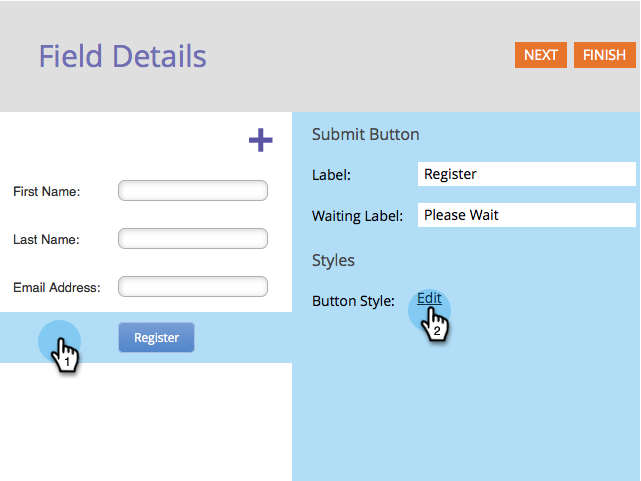
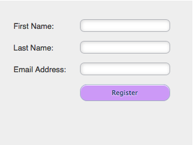

# Modifier le style et la couleur du bouton Envoyer {#change-submit-button-style-and-color}

Si vous trouvez le bouton d’envoi standard ennuyeux ou si vous avez besoin de quelque chose de plus sophistiqué, n’hésitez pas à choisir parmi un large éventail de styles de bouton prêts à l’emploi.

1. Accédez à **Marketing** **Activités**.

   

1. Sélectionnez votre formulaire et cliquez sur **Modifier** **Formulaire**.

   

1. Sélectionnez le bouton **Envoyer** et cliquez sur **Modifier** en regard de Style de bouton.

   

   >[!TIP]
   >
   >Saviez-vous que vous pouvez faire glisser le bouton Envoyer vers la gauche ou la droite pour modifier sa position ? C&#39;est si facile. Essaie-le !

1. Choisissez un style de bouton qui vous convient (faites défiler vers le haut ou vers le bas).

   

1. Vous pouvez laisser la couleur par défaut ou la personnaliser.

   

   >[!TIP]
   >
   >Vous pouvez également saisir manuellement le code de couleur.

1. Cliquez sur **Sélectionner**.

   

1. Cliquez sur **Terminer**.

   

1. Cliquez sur **Approuver et fermer**.

   

   Voilà !

   

   >[!NOTE]
   >
   >Comme de nombreux éléments graphiques, le bouton peut avoir un aspect différent selon le navigateur utilisé.

