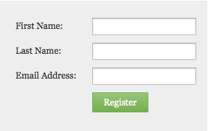

# Modification de la famille de polices du formulaire {#change-the-form-font-family}

Google Fonts sont géniaux, et nous les avons intégrés dans l&#39;éditeur de formulaires. Regardez !

>[!NOTE]
>
>Ce paramètre a un impact sur l’étiquette du formulaire, le texte de saisie et tout texte enrichi.

1. Accédez à **Marketing** **Activités**.

   

1. Sélectionnez votre formulaire, puis cliquez sur **Modifier** le **formulaire**.

   

1. Sous **Paramètres** du formulaire **, sélectionnez** Paramètres ****.

   

1. Sélectionnez la famille **de** polices de votre choix.

   >[!TIP]
   >
   >Plusieurs polices  Google sont disponibles.

   

1. Cliquez sur **Terminer**.

   

1. Cliquez sur **Approuver et fermer**.

   >[!NOTE]
   >
   >Le formulaire doit être approuvé pour être utilisé sur les landings page.

   

   >[!NOTE]
   >
   >**Rappel**
   >
   >
   >N’oubliez pas d’approuver le brouillon de landing page créé par les modifications du formulaire.

   

Voyez à quel point il était facile de modifier la famille de polices sur un formulaire ? Cool, maintenant que c&#39;est fait, apprenons comment changer la taille de police du formulaire.

>[!NOTE]
>
>**Articles connexes**
>
>* [Modification de la taille de police du formulaire](change-the-form-font-size.md)

>

