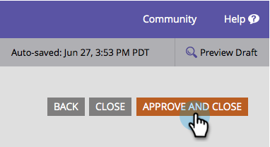

# Modification de la famille de polices du formulaire {#change-the-form-font-family}

Les polices Google sont géniales, et nous les avons intégrées dans l’éditeur de formulaires. Regardez !

>[!NOTE]
>
>Ce paramètre a un impact sur le libellé du formulaire, le texte de saisie et tout texte enrichi.

1. Accédez à **Activités marketing**.

   

1. Sélectionnez votre formulaire et cliquez sur **Modifier le formulaire**.

   

1. Sous **Paramètres de formulaire**, sélectionnez **Paramètres**.

   

1. Sélectionnez la **famille de polices** de votre choix.

   >[!TIP]
   >
   >Un groupe de [polices Google](https://www.google.com/fonts) peut être utilisé.

   

1. Cliquez sur **Terminer**.

   

1. Cliquez sur **Approuver et fermer**.

   >[!NOTE]
   >
   >Le formulaire doit être validé pour être utilisé sur les landing pages.

   

   >[!NOTE]
   >
   >N’oubliez pas d’approuver le brouillon de page d’entrée créé par les modifications du formulaire.

   

Voyez comme il était facile de changer la famille de polices sur un formulaire ? Super, maintenant que c&#39;est fait, apprenons comment changer la taille de police du formulaire.

>[!MORELIKETHIS]
>
>[Modifier la taille de police du formulaire](/help/marketo/product-docs/demand-generation/forms/form-design/change-the-form-font-size.md)
