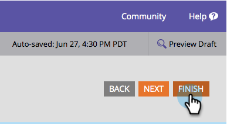

# Modification de la taille de police du formulaire {#change-the-form-font-size}

Marketo vous permet de personnaliser facilement l’apparence de vos formulaires. Vous pouvez modifier la taille de la police. Voici comment.

>[!TIP]
>
>Ce paramètre a un impact sur l’étiquette du formulaire, le texte de saisie et le texte du bouton d’envoi.

1. Accédez à **Marketing** **Activités**.

   

1. Sélectionnez votre formulaire, puis cliquez sur **Modifier** le **formulaire**.

   

1. Sous **Paramètres** **Du Formulaire**, Sélectionnez **Paramètres**.

   

1. Sélectionnez la **police** **Taille** de votre choix.

   

1. Cliquez sur **Terminer**.

   

1. Cliquez sur **Approuver et fermer**.

   >[!NOTE]
   >
   >Le formulaire doit être approuvé pour être utilisé sur les landings page.

   

   >[!NOTE]
   >
   >**Rappel**
   >
   >
   >N’oubliez pas d’approuver le brouillon de landing page créé par les modifications du formulaire.

   

Un morceau de gâteau ! Vous avez ça.