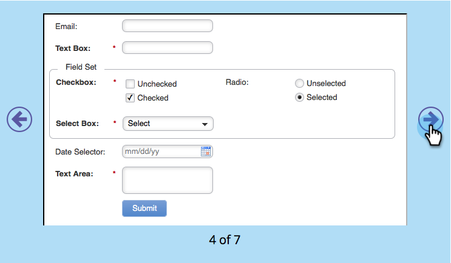

# Modifier la page CSS d’un thème de formulaire {#edit-the-css-of-a-form-theme}

Vous disposez de quelques thèmes [préconstruits que vous pouvez choisir parmi ](../../../../product-docs/demand-generation/forms/creating-a-form/select-a-form-theme.md). Mais si vous aimez modifier le CSS, vous pouvez apporter les modifications de votre choix. Voici comment.

>[!NOTE]
>
>Assurez-vous de connaître CSS si vous souhaitez l’essayer, car l’assistance marketing n’est pas configurée pour faciliter le codage personnalisé. En outre, les modifications apportées s’appliqueront uniquement au formulaire que vous êtes en train de modifier.

1. Accédez à **Marketing** **Activités**.

   

1. Sélectionnez votre formulaire et cliquez sur **Modifier** **Formulaire**.

   

1. Accédez à **Formulaire** **Paramètres**.

   

1. Sélectionnez le thème auquel vous souhaitez apporter des modifications.

   

1. Sous l’icône d’engrenage, cliquez sur **Thème de Vue CSS**.

   

1. N’hésitez pas à couper/coller cette page CSS dans votre propre éditeur. Il est en lecture seule, vous n’aurez donc besoin que du CSS de remplacement.

   

1. Cliquez sur **Fermer**.

   

1. Sous l’icône d’engrenage, cliquez sur **Modifier** **Personnalisé** **CSS**.

   

1. Saisissez votre page CSS personnalisée. Vous n&#39;en avez pas besoin, juste les parties qui sont différentes.

   

1. Lorsque vous avez terminé, cliquez sur **Enregistrer**.

   

1. Pour afficher votre formulaire personnalisé, cliquez sur **Prévisualisation** **Version préliminaire**.

   

Et c&#39;est ça !
