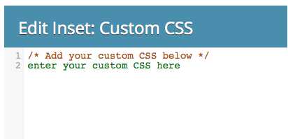

# Modifier le CSS d’un thème de formulaire {#edit-the-css-of-a-form-theme}

Vous disposez de quelques [thèmes préconfigurés parmi lesquels vous pouvez choisir](/help/marketo/product-docs/demand-generation/forms/creating-a-form/select-a-form-theme.md). Mais si vous aimez modifier le CSS, vous pouvez apporter les modifications de votre choix. Voici comment procéder.

>[!NOTE]
>
>Assurez-vous de connaître la page CSS si vous souhaitez essayer, car la prise en charge de Marketo n’est pas configurée pour faciliter le codage personnalisé. En outre, toutes les modifications apportées s’appliqueront uniquement au formulaire que vous êtes en train de modifier.

1. Accédez à **[!UICONTROL Activités marketing]**.

   

1. Sélectionnez votre formulaire et cliquez sur **[!UICONTROL Modifier le formulaire]**.

   

1. Accédez à **[!UICONTROL Paramètres du formulaire]**.

   

1. Sélectionnez le thème auquel vous souhaitez apporter des modifications.

   

1. Sous l’icône d’engrenage, cliquez sur **[!UICONTROL Afficher le thème CSS]**.

   

1. N’hésitez pas à couper/coller ce CSS dans votre propre éditeur. Il est en lecture seule, vous n’aurez donc besoin que du CSS de remplacement.

   

1. Cliquez sur **[!UICONTROL Fermer]**.

   

1. Sous l’icône d’engrenage, cliquez sur **[!UICONTROL Modifier le CSS personnalisé]**.

   

1. Saisissez votre CSS personnalisé. Vous n&#39;avez pas besoin de tout, seulement des parties qui sont différentes.

   

1. Lorsque vous avez terminé, cliquez sur **[!UICONTROL Enregistrer]**.

   

1. Pour afficher le formulaire personnalisé, cliquez sur **[!UICONTROL Aperçu du brouillon]**.

   

Et c&#39;est ça !
