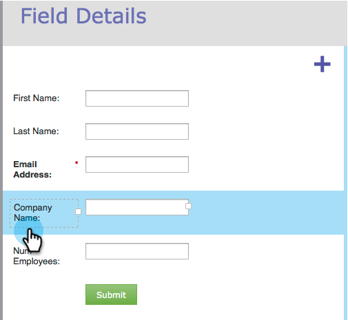

# Redimensionner la largeur d’une étiquette/d’un champ dans un formulaire {#resize-label-field-width-in-a-form}

Il existe deux manières de redimensionner la largeur de l’étiquette du champ, ainsi que la largeur du champ lui-même.

## Glissez-déposez la largeur {#drag-and-drop-the-width}

1. Dans l’[éditeur de formulaires](/help/marketo/product-docs/demand-generation/forms/form-actions/edit-a-form.md), sélectionnez le champ à redimensionner.

   

1. Faites glisser le coin du libellé ou du champ pour le redimensionner.

   

## Saisir la largeur manuellement {#enter-the-width-manually}

1. Sélectionnez le champ à redimensionner.

   

1. Saisissez une valeur en pixels pour la [!UICONTROL Largeur du libellé], la [!UICONTROL Largeur du champ] ou les deux.

   

