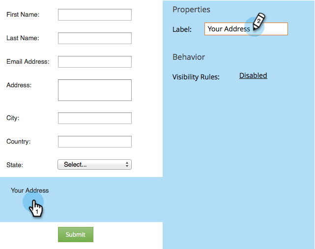

# Ajouter un objet FieldSet à un formulaire {#add-a-fieldset-to-a-form}

Les jeux de champs sont cool. Ils regroupent plusieurs champs. Vous pouvez contrôler un bloc entier à la fois !

1. Accédez à **Activités marketing**.

   

1. Sélectionnez votre formulaire et cliquez sur **Modifier le formulaire**.

   

1. Cliquez sur le signe **+** et sélectionnez **Jeu de champs**.

   

1. Sélectionnez le **jeu de champs** et saisissez une **étiquette**.

   

1. Faites glisser les champs de votre choix dans le **jeu de champs**.

   

1. Voici à quoi ça devrait ressembler une fois terminé.

   

Voilà !

>[!TIP]
>
>Vous pouvez masquer/afficher dynamiquement l’ensemble du jeu de champs en fonction d’un autre champ. Découvrez [les règles de visibilité](/help/marketo/product-docs/demand-generation/forms/form-fields/dynamically-toggle-visibility-of-a-form-field.md).
