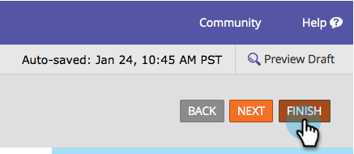

# Ajouter un texte d’indice à un champ de formulaire {#add-hint-text-to-a-form-field}

Conseils et [instructions](/help/marketo/product-docs/demand-generation/forms/form-fields/add-tooltip-instructions-to-a-form-field.md) pour aider les personnes à remplir des formulaires. Voici comment ajouter une astuce.

>[!NOTE]
>
>**Définition**
>
>Le formulaire **Conseils** est du texte à l’intérieur du champ qui disparaît lorsque le visiteur commence à saisir du texte dans le champ.
>
>Formulaire **Instructions** sont de petites info-bulles qui s’affichent lorsque le visiteur survole le champ.

1. Accédez à **[!UICONTROL Activités marketing]**.

   

1. Sélectionnez votre formulaire et cliquez sur **[!UICONTROL Modifier le formulaire]**.

   

1. Sélectionnez le champ et saisissez votre **[!UICONTROL texte d’indice]**.

   

1. Cliquez sur **[!UICONTROL Terminer]**.

   

1. Cliquez sur **[!UICONTROL Approuver et fermer]**.

   

   >[!NOTE]
   >
   >N’oubliez pas de [approuver le brouillon de la page de destination](/help/marketo/product-docs/demand-generation/landing-pages/understanding-landing-pages/approve-unapprove-or-delete-a-landing-page.md) créé par les modifications du formulaire.

   

Pour ajouter des instructions d’info-bulle à un champ de formulaire, voir [Ajouter des instructions d’info-bulle à un champ de formulaire](add-tooltip-instructions-to-a-form-field.md).
