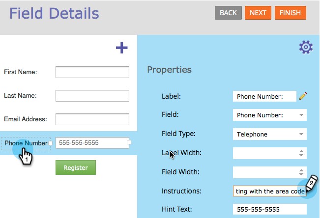

# Ajouter des instructions d’info-bulle à un champ de formulaire {#add-tooltip-instructions-to-a-form-field}

[Les ](add-hint-text-to-a-form-field.md) notes et les instructions aident les gens à remplir des formulaires. Voici comment ajouter des instructions d’info-bulle.

>[!NOTE]
>
>**Définition**
>
>Le formulaire **Astuces** est le texte qui se trouve à l’intérieur du champ et qui disparaît lorsque le visiteur commence à saisir du texte dans le champ.
>
>Les instructions **Form** sont de petites info-bulles qui apparaissent lorsque le visiteur passe le pointeur de la souris sur le champ.

1. Accédez à **Activités marketing**.

   

1. Sélectionnez votre **formulaire** et cliquez sur **Modifier le formulaire**.

   

1. Sélectionnez votre champ et saisissez **Instructions**.

   

1. Cliquez sur **Terminer**.

   

1. Cliquez sur **Approuver et fermer**.

   

   >[!NOTE]
   >
   >**Rappel**
   >
   >
   >N&#39;oubliez pas [d&#39;approuver le brouillon de landing page](../../../../product-docs/demand-generation/landing-pages/understanding-landing-pages/approve-unapprove-or-delete-a-landing-page.md) créé par les modifications du formulaire.

   

Un travail formidable ! L’info-bulle s’affiche lorsqu’un visiteur passe la souris sur le champ.

>[!NOTE]
>
>**Plongée profonde**
>
>Il y a tellement de choses que vous pouvez faire avec [forms](http://docs.marketo.com/display/docs/forms).

