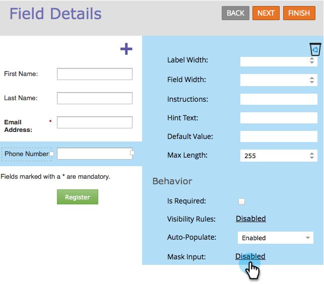

# Appliquer un masquage de saisie à un champ de formulaire {#apply-input-masking-to-a-field-in-a-form}

Vous pouvez restreindre la saisie de votre visiteur à l’aide d’un masque de saisie. Par exemple, vous pouvez souhaiter que les visiteurs et visiteuses saisissent des numéros de téléphone uniquement dans un format spécifique.

1. Accédez à **[!UICONTROL Activités marketing]**.

   

1. Sélectionnez votre formulaire et cliquez sur **[!UICONTROL Modifier le formulaire]**.

   

1. Sélectionnez votre champ et assurez-vous que le **[!UICONTROL Type de champ]*** est défini sur **[!UICONTROL Texte]**.

   >[!NOTE]
   >
   >Le masquage des entrées ne fonctionne qu’avec **[!UICONTROL Types de champs de texte]**.

   

1. Cliquez sur le lien **[!UICONTROL Entrée de masque]**.

   

1. Saisissez votre masque de saisie et cliquez sur **[!UICONTROL Enregistrer]**.

   

   >[!NOTE]
   >
   >Prêtez attention aux règles de masquage. Vous pouvez limiter la saisie aux chiffres, aux lettres, aux deux et/ou même limiter le nombre de caractères saisis.

1. Cliquez sur **[!UICONTROL Terminer]**.

   

1. Cliquez sur **[!UICONTROL Approuver et fermer]**.

   

   Découvrez-le ! Vous demandez maintenant au visiteur de saisir des nombres dans un format spécifique.

   

   >[!NOTE]
   >
   >Le champ peut ne pas afficher les régions prédéfinies comme illustré dans l’image ci-dessus. Il peut apparaître vide jusqu’à ce que le visiteur commence à saisir des nombres, qui adhèrent alors automatiquement au format de saisie que vous avez défini pour le champ.

Plutôt cool, hein ?
