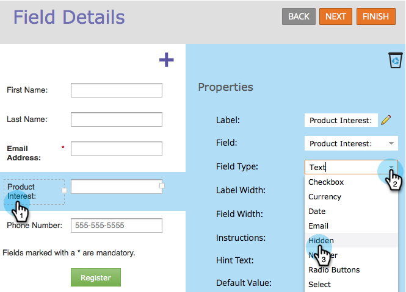

# Définir le champ de formulaire comme masqué {#set-a-form-field-as-hidden}

Les champs de formulaire masqués peuvent capturer des données en silence sans que le visiteur n’y ait saisi rien. Voici comment ça marche.

1. Accédez à **Activités marketing**.

   

1. Sélectionnez votre formulaire et cliquez sur **Modifier le formulaire**.

   

1. Sélectionnez le champ et définissez la variable **Type de champ** to **Masqué.**

   

>[!TIP]
>
>Raccourci clavier ! Après avoir sélectionné un champ de formulaire, appuyez sur Ctrl+Alt+H pour le masquer.

>[!MORELIKETHIS]
>
>[Définition d’une valeur de champ de formulaire masqué](/help/marketo/product-docs/demand-generation/forms/form-fields/set-a-hidden-form-field-value.md)
