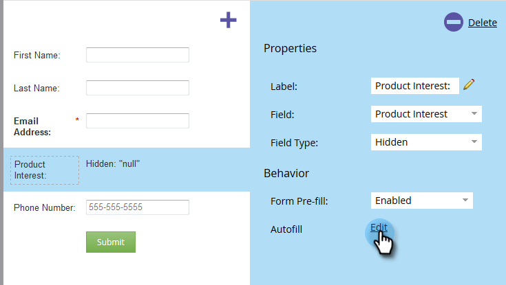
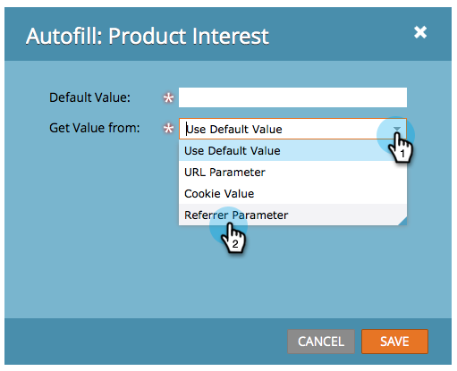

# Définir la valeur de champ de formulaire masqué {#set-a-hidden-form-field-value}

Les champs masqués sont généralement renseignés de manière dynamique. Ils ne sont pas présentés à la personne qui remplit le formulaire. Voici comment définir la valeur.

>[!PREREQUISITES]
>
>[Définir un champ de formulaire comme masqué](/help/marketo/product-docs/demand-generation/forms/form-fields/set-a-form-field-as-hidden.md)

## Sélectionner le champ {#select-the-field}

1. Dans votre formulaire, sélectionnez le champ masqué et cliquez sur **Modifier** pour **Remplissage automatique**.

   

## Utiliser la valeur par défaut {#use-default-value}

En sélectionnant Utiliser la valeur par défaut, vous pouvez coder en dur une valeur spécifique qui sera toujours utilisée lors de l’envoi de ce formulaire. Saisissez la valeur par défaut et cliquez sur Enregistrer.

## Paramètre d’URL {#url-parameter}

Si vous souhaitez capturer des paramètres d’URL (chaînes de Requête) à partir de la page sur laquelle se trouve la personne lors du remplissage du formulaire, vous pouvez utiliser **Paramètres d’URL** pour renseigner votre champ masqué.

>[!NOTE]
>
>Les paramètres sont plutôt techniques, n&#39;est-ce pas ? Une fois qu&#39;on les trouve, ils sont puissants. Cette [page de Wikipédia sur Chaînes de Requête](https://en.wikipedia.org/wiki/Query_string) est quelque peu utile.

1. Sélectionnez **Paramètre d’URL** pour **Type de valeur Get**.

   

1. Saisissez le **nom du paramètre** et cliquez sur **Enregistrer**.

   

>[!TIP]
>
>Vous pouvez entrer une valeur par défaut au cas où le paramètre d’URL serait introuvable.

## Valeur du cookie {#cookie-value}

Si vous stockez des données dans des cookies, vous pouvez utiliser **Valeur du cookie** pour récupérer les données lorsque le formulaire est envoyé.

1. Sélectionnez **Valeur du cookie** pour **Obtenir la valeur de**.

   

1. Saisissez le nom de paramètre du cookie que vous souhaitez, puis cliquez sur **Enregistrer**.

   

   >[!TIP]
   >
   >Vous pouvez entrer une valeur par défaut au cas où le paramètre/cookie serait introuvable.

## Paramètre de parrain {#referrer-parameter}

Si vous souhaitez capturer des données à partir de la page d’où provient le visiteur avant de remplir le formulaire, vous pouvez utiliser **Paramètre de Parrain**.

1. Définissez **Get Value From** sur **Paramètre de Parrain**.

   

1. Saisissez le **nom du paramètre** que vous souhaitez extraire de l’URL du parrain et cliquez sur **Enregistrer**.

   

   >[!TIP]
   >
   >Vous pouvez entrer une **valeur par défaut** au cas où le paramètre de parrain serait introuvable.

1. Cliquez sur **Terminer**.

   

1. Cliquez sur **Approuver et fermer**.

   
