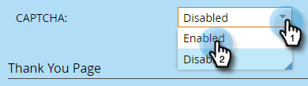

# Activation de CAPTCHA dans Marketo Forms {#enable-captcha-in-marketo-forms}

Vous pouvez activer/désactiver [!UICONTROL CAPTCHA] pour chaque formulaire.

1. Recherchez et sélectionnez le formulaire de votre choix.

   

1. Cliquez sur **[!UICONTROL Modifier le brouillon]** (si le formulaire est déjà approuvé, cliquez sur [!UICONTROL Créer un brouillon]).

   

1. Cliquez sur **[!UICONTROL Paramètres du formulaire]**, puis sur **[!UICONTROL Paramètres]**.

   

1. Ouvrez le menu déroulant **[!UICONTROL CAPTCHA]** et sélectionnez **[!UICONTROL Activé]**.

   

1. Cliquez sur **[!UICONTROL Terminer]**.

   

1. Cliquez sur **[!UICONTROL Approuver et fermer]**.

   

Les modifications apportées à cette liste peuvent prendre quelques minutes pour se propager à partir de Google.

>[!NOTE]
>
>Du texte normalisé, y compris des liens vers la politique de confidentialité et les conditions d’utilisation de Google, sera ajouté à votre ou vos formulaires compatibles avec CAPTCHA.

>[!MORELIKETHIS]
>
>[Configuration de reCAPTCHA v3](/help/marketo/product-docs/demand-generation/forms/using-captcha/setting-up-recaptcha-v3.md)
