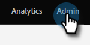

# Configuration de [!UICONTROL reCAPTCHA v3] {#setting-up-recaptcha-v3}

ReCAPTCHA v3 est une expérience fluide qui attribue un score aux envois de formulaires en fonction de leur degré de suspicion sans utiliser de texte, d’image ou de boutons. [En savoir plus](https://developers.google.com/search/blog/2018/10/introducing-recaptcha-v3-new-way-to){target="_blank"}.

## Récupérer votre [!UICONTROL centre de données] et [!UICONTROL Munchkin ID] {#retrieve-your-data-center-and-munchkin-id}

Pour l’étape 6 de la section Configuration initiale de [!UICONTROL reCAPTCHA v3] ci-dessous, vous aurez besoin du [!UICONTROL centre de données] et de l’[!UICONTROL identifiant Munchkin] de votre abonnement Marketo Engage. Voici comment les trouver.

1. Dans Marketo, cliquez sur **[!UICONTROL Admin]**.

   

1. Cliquez sur **[!UICONTROL Mon compte]**.

   

1. Faites défiler jusqu’à [!UICONTROL Informations d’assistance].

   

## Configuration initiale de [!UICONTROL reCAPTCHA v3] {#initial-recaptcha-v3-setup}

Les étapes suivantes sont effectuées en dehors de Marketo.

1. Accédez à [https://www.google.com/recaptcha/about/](https://www.google.com/recaptcha/about/){target="_blank"} puis cliquez sur Admin Console v3.

1. Connectez-vous/inscrivez-vous avec un compte Google.

1. Cliquez sur le bouton [!UICONTROL Créer] (+ signe) pour créer une clé.

1. Créez un libellé afin d’identifier la clé à utiliser pour Marketo Engage.

1. Choisissez le type **[!UICONTROL reCAPTCHA v3]**. Marketo Engage ne prend actuellement pas en charge reCAPTCHA v2.

1. Ajoutez chaque domaine utilisé par l’abonnement Marketo Engage. Les domaines non définis ici renverront des erreurs sur les formulaires où reCAPTCHA est activé. N’oubliez pas de remplacer les mots « datacenter » et « munchkinID » par les [données de votre abonnement](#retrieve-your-data-center-and-munchkin-id).

   * app-datacenter.marketo.com
   * munchkinID.mktoweb.com
   * tout domaine et alias de page de destination configurés dans l’abonnement

   >[!NOTE]
   >
   >Placer sur la liste autorisée Par exemple, si le [!UICONTROL centre de données] de votre compte est « sjst », le domaine que vous souhaitez `app-sjst.marketo.com` sera utilisé. Si votre [!UICONTROL Munchkin placer sur la liste autorisée ID] est 123-ABC-789, le domaine que vous avez supprimé est `123-ABC-789.mktoweb.com`.

1. Définissez un propriétaire et une adresse e-mail supplémentaire qui doit recevoir toutes les alertes sur ce service.

1. Acceptez les Conditions d&#39;utilisation de reCAPTCHA.

1. Cliquez sur **[!UICONTROL Envoyer]**.

   >[!NOTE]
   >
   >Conservez les clés de site et secrète à portée de main pour la configuration de Marketo Engage.

## Configuration de CAPTCHA dans Marketo Engage {#setting-up-captcha-in-marketo-engage}

>[!IMPORTANT]
>
>Après avoir suivi ces étapes et [activé CAPTCHA dans votre premier formulaire Marketo](/help/marketo/product-docs/demand-generation/forms/using-captcha/enable-captcha-in-marketo-forms.md){target="_blank"}, veillez à tester le formulaire immédiatement, car toute erreur de configuration dans la configuration reCAPTCHA peut rompre le formulaire.

1. Dans Marketo, cliquez sur **[!UICONTROL Admin]**.

   

1. Sélectionnez **[!UICONTROL CAPTCHA]** dans l’arborescence.

   

1. Cliquez sur **[!UICONTROL Modifier]** dans les paramètres [!UICONTROL CAPTCHA].

   

1. Cliquez sur la liste déroulante [!UICONTROL CAPTCHA] et choisissez [!UICONTROL reCAPTCHA v3].

   

1. Insérez les **[!UICONTROL Clé secrète]** et **[!UICONTROL Clé de site]**. Cliquez sur **[!UICONTROL Enregistrer]** lorsque vous avez terminé.

   

>[!MORELIKETHIS]
>
>[Activer CAPTCHA dans Marketo Forms](/help/marketo/product-docs/demand-generation/forms/using-captcha/enable-captcha-in-marketo-forms.md)
