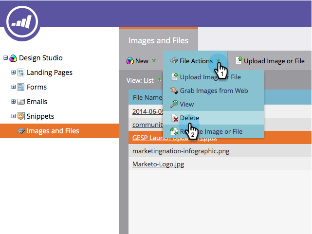

# Supprimer une image ou un fichier téléchargé {#delete-an-uploaded-image-or-file}

1. Accédez au **Design** **Studio**.

   

1. Sélectionnez **Images et fichiers** dans le menu de gauche, puis cliquez sur en regard du nom du fichier à supprimer.

   

1. Cliquez sur la liste déroulante **Actions de fichier** et sélectionnez **Supprimer**.

   

1. Vérifiez que vous avez sélectionné le fichier approprié et cliquez sur **Supprimer**.

   

   >[!CAUTION]
   >
   >Les images et les fichiers supprimés sont complètement supprimés de Marketo et ne peuvent pas être récupérés.  Ils ne seront plus affichés sur les landings page ou les courriels où ils étaient utilisés.

1. Vous serez renvoyé à la page **Images** et **Fichiers**, où vous verrez que votre fichier a été supprimé.

   

Bien joué !

>[!MORELIKETHIS]
>
>* [Remplacement d’une image ou d’un fichier téléchargé](/help/marketo/product-docs/demand-generation/images-and-files/replace-an-uploaded-image-or-file.md)
>* [Recherche d’images et de fichiers téléchargés](/help/marketo/product-docs/demand-generation/images-and-files/search-uploaded-images-and-files.md)
>* [Rechercher l’URL d’une image ou d’un fichier téléchargé](/help/marketo/product-docs/demand-generation/images-and-files/find-the-url-of-an-uploaded-image-or-file.md)

