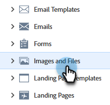

# Rechercher l’URL d’une image chargée ou d’un fichier chargé {#find-the-url-of-an-uploaded-image-or-file}

Pour trouver l’URL d’une image ou d’un fichier chargé, procédez comme suit.

1. Accédez au **[!UICONTROL Design Studio]**.

   

1. Cliquez sur **[!UICONTROL Images et fichiers]**.

   

1. Sélectionnez la ressource souhaitée.

   

1. Le **[!UICONTROL URL]** s’affiche sur la page de détails.

   

>[!MORELIKETHIS]
>
>[Remplacer une image ou un fichier chargé](/help/marketo/product-docs/demand-generation/images-and-files/replace-an-uploaded-image-or-file.md){target="_blank"}
