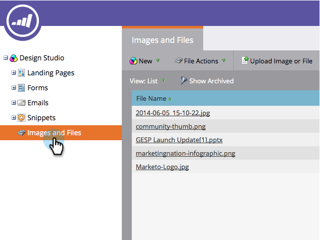

# Saisir les images d’une page web {#grab-the-images-from-a-web-page}

Pour ajouter des images d&#39;une page web, copiez l&#39;adresse web (URL) de la page contenant les images désirées, puis suivez ces étapes simples.

1. Accédez à **Design Studio**.

   

1. Cliquez sur **New** et **Grab Images from Web**.

   

1. Sélectionnez le dossier **Images et fichiers**, collez l’adresse web (URL) dans la zone de texte URL, puis cliquez sur **Suivant**.

   

   >[!NOTE]
   >
   >Cette fonction ne fonctionne pas avec les URL pointant directement vers une image. Utilisez l’URL de la page web contenant les images.

1. Sélectionnez les images à ajouter et cliquez sur **Importer**.

   

1. Vos images sont maintenant importées et disponibles pour une utilisation dans les emails et les landing pages.

   

1. Vous pouvez voir toutes les images disponibles dans **Images et fichiers**.

   

Beau travail, maître d&#39;image !

>[!MORELIKETHIS]
>
>* [Ajout d’images et de fichiers à Marketo](/help/marketo/product-docs/demand-generation/images-and-files/add-images-and-files-to-marketo.md)
>* [Organisation de vos images et fichiers à l’aide de dossiers](/help/marketo/product-docs/demand-generation/images-and-files/organize-your-images-and-files-using-folders.md)
>* [Rechercher l’URL d’une image ou d’un fichier téléchargé](/help/marketo/product-docs/demand-generation/images-and-files/find-the-url-of-an-uploaded-image-or-file.md)
>* [Télécharger des images et des fichiers de la boîte](/help/marketo/product-docs/demand-generation/images-and-files/upload-images-and-files-from-box.md)
