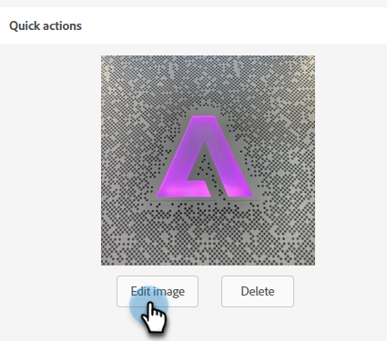

# Éditeur d’image {#image-editor}

L’éditeur d’images vous permet d’apporter des modifications rapides et légères à vos images en Marketo Engage.

1. Accédez à **[!UICONTROL Design Studio]**.

   

1. Recherchez et sélectionnez votre image.

   

1. Cliquez sur le bouton **[!UICONTROL Modifier l&#39;image]** .

   

1. Effectuez un choix parmi diverses fonctions de la barre d’outils supérieure. Cliquez sur **[!UICONTROL Enregistrer]** lorsque vous avez terminé.

   
