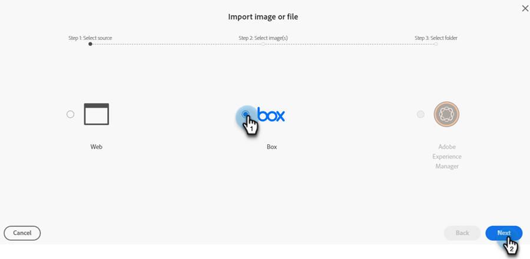
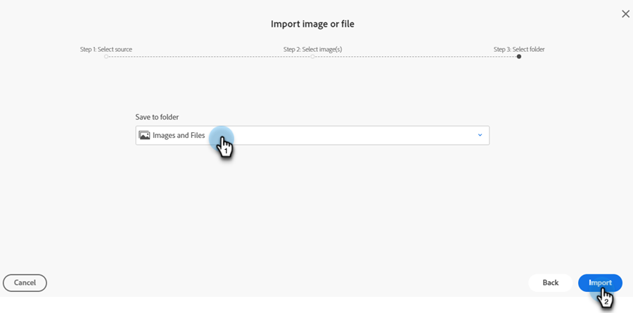

# Nouveau document Ajouter des images {#new-add-images-doc}

Vous disposez de plusieurs options pour ajouter de nouveaux fichiers/images à votre référentiel d’images et de fichiers.

## Charger l&#39;image ou le fichier {#upload-image-or-file}

1. Accédez au **Design Studio**.

   

1. Sélectionnez **[!UICONTROL Images et fichiers]**

   

1. Cliquez sur la liste déroulante **[!UICONTROL Actions relatives aux images et aux fichiers]** et sélectionnez **[!UICONTROL Charger une image ou un fichier]**.

   

1. Effectuez un glisser-déposer de l’image ou du fichier souhaité, ou recherchez-le sur votre ordinateur.

   

1. Une fois la ressource sélectionnée, cliquez sur **Charger**.

   

## Importer une image ou un fichier {#import-image-or-file}

Vous disposez de trois options pour importer une image. Passons en revue chacun d&#39;eux.

### Import depuis le Web {#import-from-the-web}

Texte

1. Suivez les étapes 1 et 2 [ci-dessus](#upload-image-or-file).

1. Cliquez sur la liste déroulante **[!UICONTROL Actions relatives aux images et aux fichiers]** et sélectionnez **[!UICONTROL Importer une image ou un fichier]**.

   

1. Sélectionnez l&#39;option **[!UICONTROL Web]** et cliquez sur **[!UICONTROL Suivant]**.

   

1. Saisissez ou collez l’URL dans l’image souhaitée, puis cliquez sur **Suivant**.

PICC

1. Cliquez sur VIDE.

PICC

### Importer depuis Box {#import-from-box}

Texte

1. Suivez les étapes 1 et 2 [ci-dessus](#upload-image-or-file).

1. Cliquez sur la liste déroulante **[!UICONTROL Actions relatives aux images et aux fichiers]** et sélectionnez **[!UICONTROL Importer une image ou un fichier]**.

   

1. Sélectionnez l’option **[!UICONTROL Zone]** et cliquez sur **[!UICONTROL Suivant]**.

   

   >[!NOTE]
   >
   >Si vous ne l&#39;avez pas encore fait, il vous sera demandé de vous connecter à votre compte Box pour accorder l&#39;accès.

1. Sélectionnez le dossier Box de votre choix et cliquez sur **[!UICONTROL Suivant]**.

   

1. Sélectionnez la ou les images souhaitées, puis cliquez sur **[!UICONTROL Suivant]**.

   

1. Sélectionnez le dossier Marketo Engage dans lequel vous souhaitez enregistrer l’image. Dans cet exemple, nous la laisserons sous le nom Images et fichiers (par défaut). Cliquez sur **Importer**.

   

### Importer depuis Adobe Experience Manager {#import-from-adobe-experience-manager}

Texte

1. Suivez les étapes 1 et 2 [ci-dessus](#upload-image-or-file).

1. Cliquez sur la liste déroulante **[!UICONTROL Actions relatives aux images et aux fichiers]** et sélectionnez **[!UICONTROL Importer une image ou un fichier]**.

   

1. Sélectionnez l&#39;option **[!UICONTROL Adobe Experience Manager]** et cliquez sur **[!UICONTROL Suivant]**.

   

   >[!NOTE]
   >
   >Si vous ne l’avez pas encore fait, il vous sera demandé de vous connecter à votre compte AEM.

1. Texte

PICC

1. Texte

PICC

1. Texte
