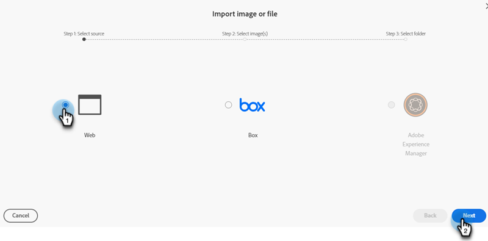

# Nouveau document Ajouter des images {#new-add-images-doc}

Vous disposez de plusieurs options pour ajouter de nouveaux fichiers/images à votre référentiel Images et Fichiers .

## Charger Image ou Fichier {#upload-image-or-file}

1. Accédez au **Design Studio**.

   

1. Sélectionner **[!UICONTROL Images et fichiers]**

   

1. Cliquez sur le bouton **[!UICONTROL Actions d’image et de fichier]** et sélectionnez **[!UICONTROL Chargement d’une image ou d’un fichier]**.

   

1. Faites glisser et déposez l’image ou le fichier souhaité, ou recherchez-le sur votre ordinateur.

   

1. Une fois la ressource sélectionnée, cliquez sur **Télécharger**.

   

## Importer une image ou un fichier {#import-image-or-file}

Vous disposez de trois options pour importer une image. Passons en revue chacun d&#39;entre eux.

### Importer depuis le Web {#import-from-the-web}

Texte

1. Suivez les étapes 1 et 2 [from above](#upload-image-or-file).

1. Cliquez sur le bouton **[!UICONTROL Actions d’image et de fichier]** et sélectionnez **[!UICONTROL Importer une image ou un fichier]**.

   

1. Sélectionnez la variable **Web** .

   

1. Texte

PICC

### Importer depuis une boîte {#import-from-box}

Texte

1. Suivez les étapes 1 et 2 [from above](#upload-image-or-file).

1. Cliquez sur le bouton **[!UICONTROL Actions d’image et de fichier]** et sélectionnez **[!UICONTROL Importer une image ou un fichier]**.

PICC

1. Texte

### Importer depuis Adobe Experience Manager {#import-from-adobe-experience-manager}

Texte

1. Suivez les étapes 1 et 2 [from above](#upload-image-or-file).

1. Cliquez sur le bouton **[!UICONTROL Actions d’image et de fichier]** et sélectionnez **[!UICONTROL Importer une image ou un fichier]**.

PICC

1. Texte
