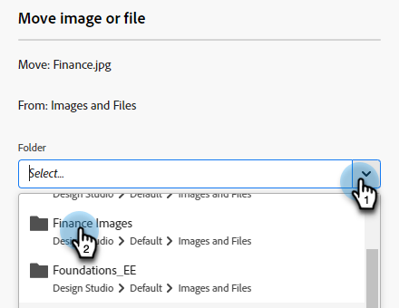

# Organisation des images et des fichiers à l’aide de dossiers {#organize-your-images-and-files-using-folders}

La création de dossiers vous permet de déplacer des images et des fichiers, de voir uniquement l’ensemble des images de votre choix et de les télécharger directement vers un dossier spécifique.

1. Accédez au **[!UICONTROL Design Studio]**.

   

1. Clic droit sur **[!UICONTROL Images et fichiers]** et sélectionnez **[!UICONTROL Nouveau dossier]**.

   

1. Nommez votre dossier et cliquez sur **[!UICONTROL Créer]**.

   

1. Revenir à **[!UICONTROL Images et fichiers]** et sélectionnez la ressource à déplacer. Cliquez sur le bouton **[!UICONTROL Actions d’image et de fichier]** et sélectionnez **[!UICONTROL Déplacer]**.

   

1. Sélectionnez le dossier souhaité.

   

1. Cliquez sur **Move**.

   

>[!MORELIKETHIS]
>
>[Recherche d’images et de fichiers téléchargés](/help/marketo/product-docs/demand-generation/images-and-files/search-uploaded-images-and-files.md){target="_blank"}
