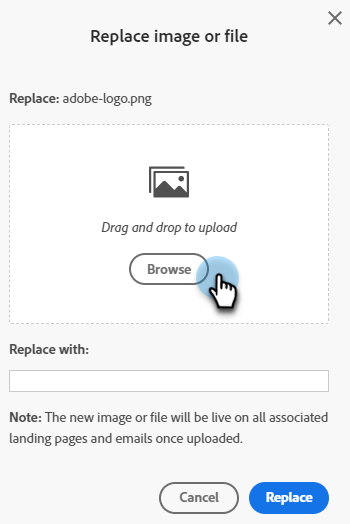

# Remplacer une image chargée ou un fichier chargé {#replace-an-uploaded-image-or-file}

1. Accédez au **[!UICONTROL Design Studio]**.

   

1. Cliquez sur **[!UICONTROL Images et fichiers]**.

   

1. Sélectionnez la ressource à remplacer. Cliquez sur la liste déroulante **[!UICONTROL Actions relatives aux images et aux fichiers]** et sélectionnez **[!UICONTROL Remplacer l’image ou le fichier]**.

   

1. Effectuez un glisser-déposer ou recherchez sur votre ordinateur l&#39;image/le fichier de remplacement.

   

   >[!NOTE]
   >
   >Le type de fichier de remplacement doit être identique à l’original (par exemple, .jpg)

1. Après avoir sélectionné le fichier/image de remplacement, cliquez sur **[!UICONTROL Remplacer]**.

   

   >[!NOTE]
   >
   >Le nom du fichier de remplacement sera modifié pour correspondre au nom du fichier précédent.

>[!MORELIKETHIS]
>
>* [Rechercher les images et fichiers chargés](/help/marketo/product-docs/demand-generation/images-and-files/search-uploaded-images-and-files.md){target="_blank"}
>* [Rechercher l’URL d’une image ou d’un fichier chargé](/help/marketo/product-docs/demand-generation/images-and-files/find-the-url-of-an-uploaded-image-or-file.md){target="_blank"}
