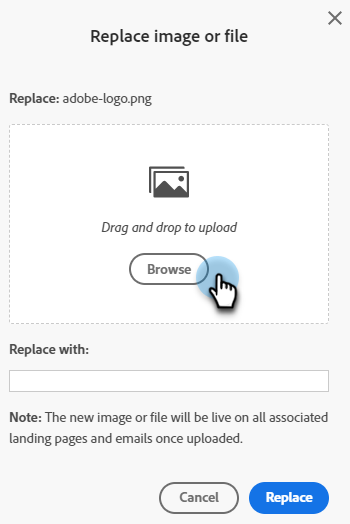

# Remplacer une image ou un fichier téléchargé {#replace-an-uploaded-image-or-file}

1. Accédez à **[!UICONTROL Design Studio]**.

   

1. Cliquez sur **[!UICONTROL Images et fichiers]**.

   

1. Sélectionnez la ressource à remplacer. Cliquez sur la liste déroulante **[!UICONTROL Actions image et fichier]** et sélectionnez **[!UICONTROL Remplacer l’image ou le fichier]**.

   

1. Faites glisser et déposez ou parcourez votre ordinateur pour rechercher l’image/le fichier de remplacement.

   

   >[!NOTE]
   >
   >Le type de fichier de remplacement doit être identique à l’original (par exemple, .jpg).

1. Après avoir sélectionné l’image/le fichier de remplacement, cliquez sur **[!UICONTROL Remplacer]**.

   

   >[!NOTE]
   >
   >Le nom du fichier de remplacement change pour correspondre au nom du fichier précédent.

Bon boulot !

>[!MORELIKETHIS]
>
>* [Recherche d’images et de fichiers téléchargés](/help/marketo/product-docs/demand-generation/images-and-files/search-uploaded-images-and-files.md){target="_blank"}
>* [Rechercher l’URL d’une image ou d’un fichier téléchargé](/help/marketo/product-docs/demand-generation/images-and-files/find-the-url-of-an-uploaded-image-or-file.md){target="_blank"}
