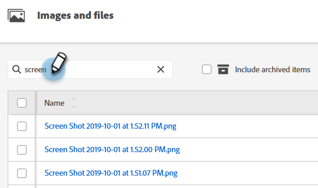

# Rechercher des images et fichiers chargés {#search-uploaded-images-and-files}

Découvrez comment rechercher une image ou un fichier.

1. Accédez au **[!UICONTROL Design Studio]**.

   

1. Cliquez sur **[!UICONTROL Images et fichiers]** pour obtenir la liste complète de tous les fichiers chargés.

   

1. Dans la zone Rechercher , saisissez le mot par lequel le fichier commence et appuyez sur **Entrée**.

   

>[!NOTE]
>
>Pour le moment, la recherche d’images et de fichiers utilise uniquement la fonctionnalité « commence par ».

>[!MORELIKETHIS]
>
>* [Remplacer une image ou un fichier chargé](/help/marketo/product-docs/demand-generation/images-and-files/replace-an-uploaded-image-or-file.md){target="_blank"}
>* [Organisez vos images et fichiers à l’aide de dossiers](/help/marketo/product-docs/demand-generation/images-and-files/organize-your-images-and-files-using-folders.md){target="_blank"}
