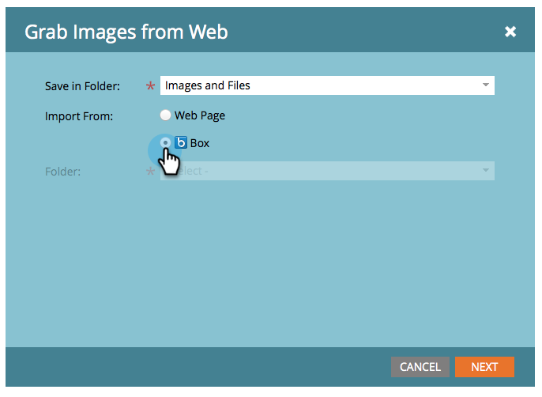
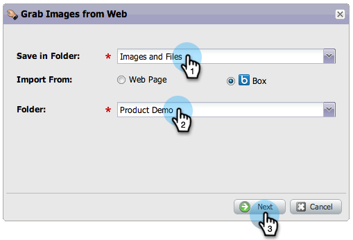

# Charger des images et fichiers depuis Box {#upload-images-and-files-from-box}

Vous pouvez charger des fichiers depuis Box pour les utiliser sur les landing pages et les e-mails.

1. Accédez à **[!UICONTROL Design Studio]**.

   

1. Accédez à **[!UICONTROL Images et fichiers]**. Cliquez sur **[!UICONTROL Actions du fichier]** et sélectionnez **[!UICONTROL Capturer des images à partir du Web]**.

   

1. Cliquez sur **[!UICONTROL Box]**.

   

1. Saisissez votre nom d’utilisateur [!DNL Box].

   

1. Autorisez Marketo à accéder à votre compte [!DNL Box].

   

1. Choisissez l’emplacement où vous souhaitez enregistrer les fichiers. Sélectionnez ensuite le dossier **[!DNL Box]** à partir duquel vous souhaitez effectuer le chargement. Cliquez sur **[!UICONTROL Suivant]**.

   

1. Sélectionnez les fichiers à charger. Cliquez sur **[!UICONTROL Importer]**.

   

Vos fichiers sont maintenant prêts à être utilisés sur vos pages de destination et dans vos e-mails.
