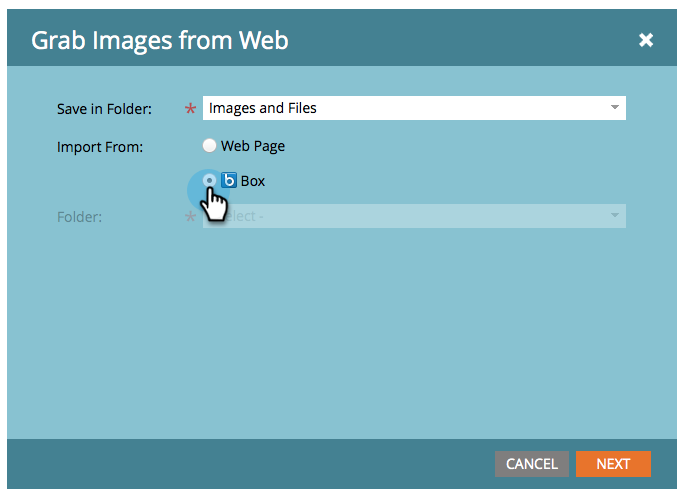

# Télécharger des images et des fichiers à partir de la zone {#upload-images-and-files-from-box}

Vous pouvez télécharger des fichiers depuis Box pour les utiliser sur des landings page et des courriers électroniques.

1. Accédez à **Design** **Studio**.

   

1. Accédez à** Images et fichiers**. Cliquez sur **Actions de fichier** et sélectionnez **Capturer les images à partir du Web**.

   

1. Cliquez sur **Case**.

   

1. Entrez votre identifiant de boîte.

   

1. Autorisez Marketing à accéder à votre compte Box.

   

1. Choisissez l’emplacement d’enregistrement des fichiers. Sélectionnez ensuite le dossier **Box** à partir duquel vous souhaitez effectuer le téléchargement. Cliquez sur **Suivant**.

   

1. Sélectionnez les fichiers à télécharger. Cliquez sur **Importer**.

   

Vos fichiers sont maintenant prêts à être utilisés sur vos landings page et courriels !