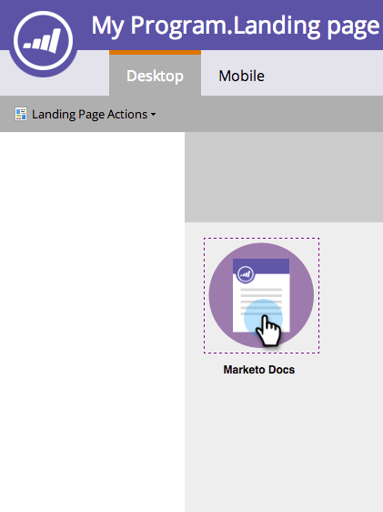

# Ajouter un lien vers une image dans une page de destination à structure libre {#add-a-link-to-an-image-in-a-free-form-landing-page}

Pour transformer une image de votre page de destination en lien cliquable, procédez comme suit.

>[!PREREQUISITES]
>
>[Ajouter une image à une page de destination de forme libre](/help/marketo/product-docs/demand-generation/landing-pages/free-form-landing-pages/add-an-image-to-a-free-form-landing-page.md)

1. Cliquez sur l’image à laquelle vous souhaitez ajouter un lien.

   

1. Développez la **[!UICONTROL Feuille de propriétés]**.

   

1. Copiez ou saisissez le lien dans la zone **[!UICONTROL linkUrl]**.

   

   Vous avez correctement ajouté un lien vers une image sur votre page de destination. Vous pouvez maintenant [prévisualiser la page](/help/marketo/product-docs/demand-generation/landing-pages/landing-page-actions/preview-a-landing-page.md) pour la voir en action.

>[!TIP]
>
>Testez toujours vos pages.
