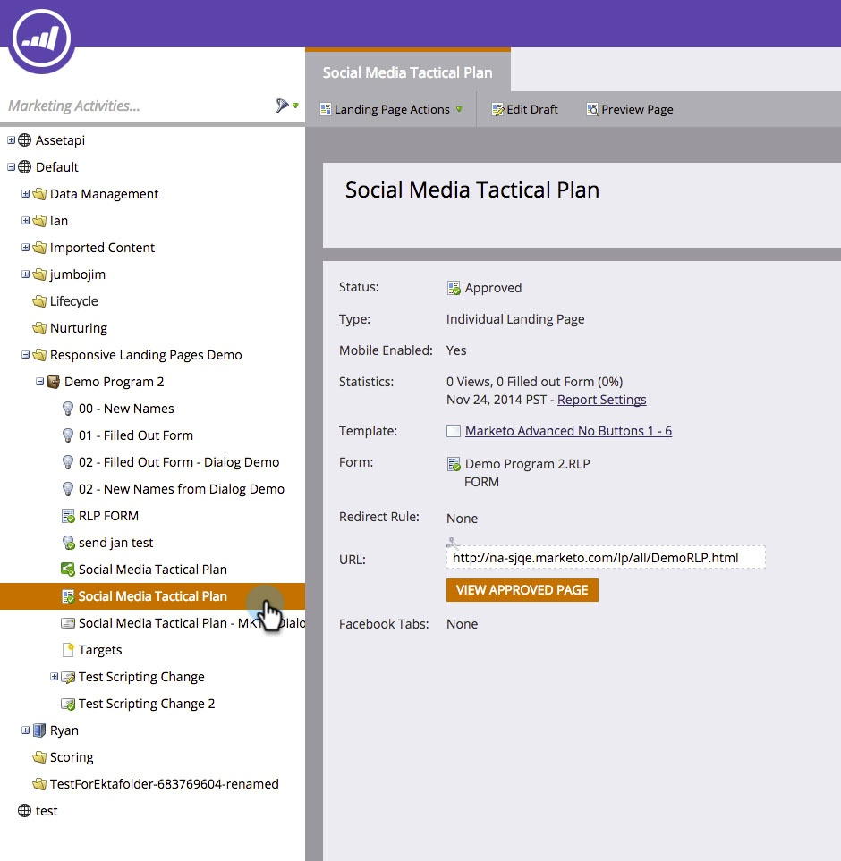
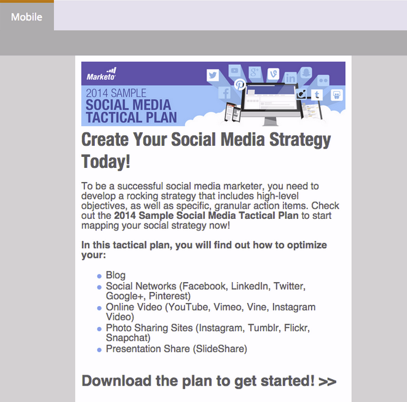

# Ajouter une vue mobile à votre page de destination à structure libre {#add-a-mobile-view-for-your-free-form-landing-page}

Vous pouvez optimiser vos pages de destination de forme libre pour les afficher correctement sur les smartphones.

>[!NOTE]
>
>La vue mobile fonctionne sur les écrans d’une largeur de 480 px (ou moins). En d’autres termes, les smartphones. En savoir plus [sur les résolutions des appareils](https://www.mydevice.io/).

1. Accédez à **[!UICONTROL Activités marketing]**.

   

1. Sélectionnez une page de destination de forme libre.

   

1. Cliquez sur **[!UICONTROL Modifier le brouillon]**.

   

1. Cliquez sur l’onglet **[!UICONTROL Mobile]**.

   

1. Cliquez sur **[!UICONTROL Activer]**.

   

   >[!CAUTION]
   >
   >Il se peut que le modèle à structure libre doive être mis à niveau. Si ce message s’affiche, découvrez rapidement comment [rendre compatible un modèle de page de destination de forme libre existant](/help/marketo/product-docs/demand-generation/landing-pages/landing-page-templates/make-an-existing-free-form-landing-page-template-mobile-compatible.md).

1. Vous avez maintenant activé la version mobile de votre page de destination. Cliquez sur **[!UICONTROL Fermer]**.

   

   Vous pouvez désormais [personnaliser votre vue mobile](/help/marketo/product-docs/demand-generation/landing-pages/free-form-landing-pages/customize-mobile-view-for-your-free-form-landing-page.md).

   
