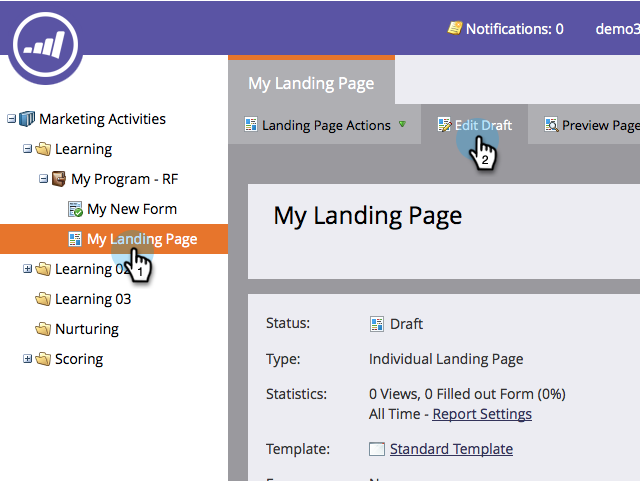
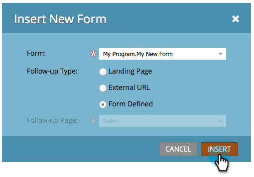

# Ajouter un nouveau formulaire à une page de destination à structure libre {#add-a-new-form-to-a-free-form-landing-page}

>[!PREREQUISITES]
>
>* [Créer un formulaire](/help/marketo/product-docs/demand-generation/forms/creating-a-form/create-a-form.md)
>* [Créer une page de destination de forme libre](/help/marketo/product-docs/demand-generation/landing-pages/free-form-landing-pages/create-a-free-form-landing-page.md)

1. Accédez à **[!UICONTROL Activités marketing]**.

   

1. Recherchez votre page de destination et cliquez sur **[!UICONTROL Modifier le brouillon]**.

   

1. Effectuez un glisser-déposer de l’élément **[!UICONTROL Form]** sur la page.

   

1. Recherchez et sélectionnez le formulaire à ajouter.

   

1. Trois options s’offrent à vous pour choisir votre page de relance :

   * **[!UICONTROL Page de destination]** - pour choisir une page de destination Marketo
   * **[!UICONTROL URL externe]** - pour sélectionner l’URL de votre choix
   * **[!UICONTROL Formulaire défini]** - pour utiliser les paramètres définis au niveau du formulaire

   >[!NOTE]
   >
   >**Définition**
   >
   >La page de suivi est la page que les personnes verront après avoir envoyé le formulaire.

1. Cliquez sur **[!UICONTROL Insérer]**.

   

Fermez l’éditeur de page de destination et [approuvez le brouillon de page de destination](/help/marketo/product-docs/demand-generation/landing-pages/understanding-landing-pages/approve-unapprove-or-delete-a-landing-page.md).
