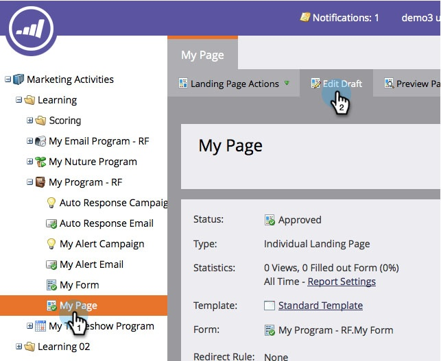

# Ajouter un bouton Social à une page de destination à structure libre {#add-a-social-button-to-a-free-form-landing-page}

Un bouton de réseau social encourage les utilisateurs à partager votre contenu avec leurs amis. Déposez-le sur des pages de destination de forme libre, sur Facebook et sur votre site web.

>[!AVAILABILITY]
>
>Tous les utilisateurs de Marketo Engage n’ont pas acheté cette fonctionnalité. Pour plus d’informations, contactez l’équipe du compte Adobe (votre gestionnaire de compte).

1. Accédez à votre page de destination de forme libre et cliquez sur **[!UICONTROL Modifier le brouillon]**.

   

1. Faites glisser le pointeur de la souris sur **[!UICONTROL Bouton social]** à partir des éléments sur la droite.

   

1. Sélectionnez **[!UICONTROL Boutons sociaux (avec Analytics)]**.

   

   Une fois votre page de destination active, vous pouvez afficher l’activité générée par votre bouton de réseau social (avec Analytics) dans le tableau de bord des réseaux sociaux.

   Si vous ajoutez plutôt un [!UICONTROL Bouton J’aime/Recommander (Lite)], consultez le nombre de partages dans le [rapport de performances sur les pages de destination](/help/marketo/product-docs/demand-generation/landing-pages/understanding-landing-pages/landing-page-performance-report.md).

1. Sélectionnez **[!UICONTROL Créer]** dans le menu déroulant.

   >[!NOTE]
   >
   >Vous pouvez également créer un bouton social dans un programme en sélectionnant **[!UICONTROL Nouveau]** > **[!UICONTROL Nouvelle ressource locale]**.

1. Nommez votre bouton social, sélectionnez **[!UICONTROL Aucun]** dans **[!UICONTROL Cloner à partir de]**, puis cliquez sur **[!UICONTROL Insérer]**.

   

   >[!TIP]
   >
   >Pour gagner du temps, vous pouvez utiliser l’option **[!UICONTROL Cloner à partir de]** pour copier tous les paramètres d’un bouton social existant.

1. Publiez la landing page [sur Facebook](/help/marketo/product-docs/demand-generation/facebook/publish-landing-pages-to-facebook.md) et placez le bouton social sur votre site web.

Vous avez ajouté un bouton social à votre page de destination. Approuvez la page de destination lorsque vous êtes prêt(e).
