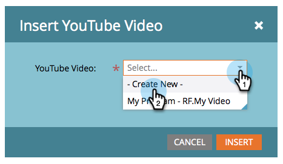

# Ajouter une vidéo à une page de destination à structure libre {#add-a-video-to-a-free-form-landing-page}

Placez des vidéos avec des options de partage sur les réseaux sociaux sur vos landing pages.

>[!AVAILABILITY]
>
>Tous les utilisateurs de Marketo Engage n’ont pas acheté cette fonctionnalité. Pour plus d’informations, contactez l’équipe du compte Adobe (votre gestionnaire de compte).

1. Accédez à votre page de destination de forme libre et cliquez sur **[!UICONTROL Modifier le brouillon]**.

   

1. Faites glisser sur **[!UICONTROL Vidéo]** à partir des éléments sur la droite.

   

1. Sélectionnez **[!UICONTROL Créer]** dans le menu déroulant.

   

   >[!NOTE]
   >
   >La fonction **[!UICONTROL Créer]** apparaît uniquement dans [!UICONTROL Activités marketing] ; elle n’est pas disponible dans [!UICONTROL Design Studio]. Seules les vidéos déjà créées sont disponibles dans Design Studio. Cependant, vous pouvez créer un partage vidéo _dans un programme_ en sélectionnant **[!UICONTROL Nouveau]** > **[!UICONTROL Nouvelle ressource locale]**. Vous pouvez ensuite la sélectionner dans la liste déroulante, comme illustré ici.

1. Saisissez l’URL de la vidéo YouTube, puis nommez-la. Dans la liste déroulante **[!UICONTROL Cloner à partir de]** sélectionnez **[!UICONTROL Aucun]**, puis cliquez sur **[!UICONTROL Insérer]**.

   

>[!TIP]
>
>Pour gagner du temps, vous pouvez utiliser l’option **[!UICONTROL Cloner à partir de]** pour copier tous les paramètres d’un partage vidéo existant.

Vous avez ajouté un partage vidéo à votre page de destination de forme libre. Approuvez la page de destination et votre partage vidéo est en ligne. Vous pouvez également [publier la page de destination sur Facebook](/help/marketo/product-docs/demand-generation/facebook/publish-landing-pages-to-facebook.md) ou partager la vidéo sur votre site web.
