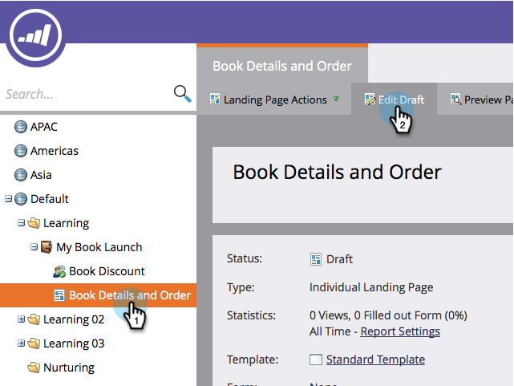

# Ajout d’une vidéo à une page d’entrée de forme libre {#add-a-video-to-a-free-form-landing-page}

Placez des vidéos avec des options de partage sur vos pages d’entrée.

>[!AVAILABILITY]
>
>Tous les utilisateurs de Marketo Engage n’ont pas acheté cette fonctionnalité. Pour plus d’informations, contactez l’équipe du compte d’Adobe (votre gestionnaire de compte).

1. Accédez à votre page d’entrée de formulaire libre et cliquez sur **Modifier le brouillon**.

   

1. Effectuez un glisser-déposer **Vidéo** des éléments sur la droite.

   

1. Sélectionner **Créer** dans le menu déroulant.

   

   >[!NOTE]
   >
   >La variable **Créer** apparaît uniquement dans les activités marketing ; elle n’est pas disponible dans Design Studio. Seules les vidéos déjà créées sont disponibles dans Design Studio. Cependant, vous pouvez créer un partage vidéo. _dans un programme_ en sélectionnant **Nouveau** > **Nouvelle ressource locale**. Vous pouvez ensuite la sélectionner dans la liste déroulante, comme illustré ici.

1. Saisissez l’URL de la vidéo YouTube, puis attribuez un nom à votre vidéo. Sous la liste déroulante Cloner à partir de , sélectionnez **Aucun**, puis cliquez sur **Insérer**.

   

>[!TIP]
>
>Pour gagner du temps, vous pouvez utiliser la variable **Cloner à partir de** pour copier tous les paramètres d’un partage vidéo existant.

Félicitations ! Vous avez ajouté un partage vidéo à votre page d’entrée de forme libre. Approuvez la page d’entrée et le partage vidéo est actif. Vous pouvez également [publier la landing page sur Facebook ;](/help/marketo/product-docs/demand-generation/facebook/publish-landing-pages-to-facebook.md) ou [placer le partage vidéo sur votre site web ;](/help/marketo/product-docs/demand-generation/social/social-functions/deploy-social-on-your-website.md).

>[!MORELIKETHIS]
>
>Vous avez terminé, mais vous pouvez modifier les paramètres de votre partage vidéo si nécessaire. Commencer par  [personnalisation du flux de partage](/help/marketo/product-docs/demand-generation/social/configuring-social-actions/customize-video-share-flow.md) (quand et où l’invite de partage s’ouvre).
