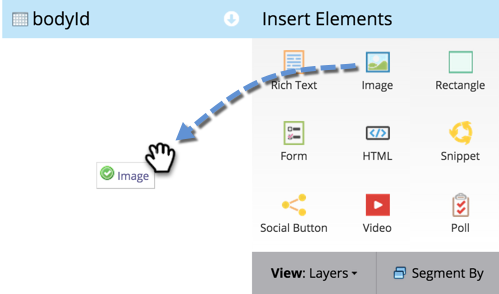

# Ajouter une image à une page de destination à structure libre {#add-an-image-to-a-free-form-landing-page}

>[!PREREQUISITES]
>
>[Ajouter des images et des fichiers à Marketo](/help/marketo/product-docs/demand-generation/images-and-files/add-images-and-files-to-marketo.md)

1. Sélectionnez votre page de destination de forme libre et cliquez sur **[!UICONTROL Modifier le brouillon]**.

   

1. Dans l&#39;éditeur, faites glisser sur l&#39;élément **[!UICONTROL Image]**.

   

1. Recherchez et sélectionnez l’image de votre choix.

   

1. Cliquez sur **[!UICONTROL Insérer]**.

   

   Vous avez ajouté une image à votre page de destination de forme libre.

   
