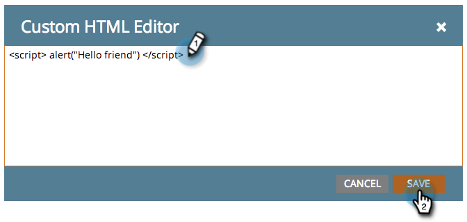

# Ajouter du code HTML personnalisé à un Landing page de formulaire libre {#adding-custom-html-to-a-free-form-landing-page}

Vous pouvez ajouter des scripts personnalisés, CSS ou d’autres éléments HTML aux landings page.

>[!NOTE]
>
>La prise en charge du marketing n’est pas configurée pour aider à résoudre les problèmes liés au code HTML personnalisé. Pour obtenir de l’aide sur HTML, veuillez consulter un développeur Web.

1. Sélectionnez votre landing page et cliquez sur **Modifier le brouillon**.

   

1. Dans l’éditeur de landing page, faites glisser l’élément **HTML**.

   

1. Entrez votre code HTML personnalisé et cliquez sur **Enregistrer**.

   

Sympa ! Placez les scripts ou les feuilles de style CSS que vous souhaitez dans cette liste.

>[!TIP]
>
>Dans la mesure du possible, testez votre source HTML personnalisée dans un environnement local avant de la déployer dans un landing page.

>[!CAUTION]
>
>Si votre code HTML personnalisé n’est pas rendu (par exemple, une fonction JavaScript invisible ou CSS), placez l’élément dans un emplacement mémorable, comme en haut à gauche. Le contour de l&#39;élément n&#39;est visible que lorsque vous cliquez dans sa zone.
