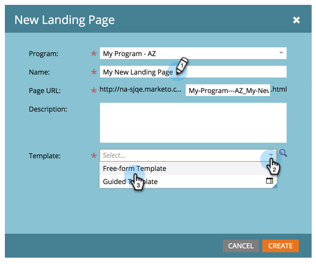

# Création d’un Landing page de forme libre {#create-a-free-form-landing-page}

Les landings page à structure libre peuvent être créés en tant que ressources locales d’un programme ou dans Design Studio pour être utilisés globalement.

>[!NOTE]
>
>Les modes de landing page sont définis par leur modèle. [En savoir ](../../../../product-docs/demand-generation/landing-pages/understanding-landing-pages/understanding-free-form-vs-guided-landing-pages.md) plus sur les modèles de landing page libre et guidé.

## Création d’un Landing page de forme libre dans un Programme {#create-a-free-form-landing-page-in-a-program}

1. Accédez à **Activités marketing**.

   

1. Cliquez sur votre programme.

   

1. Cliquez sur **Nouveau**. Sélectionnez **Nouveau fichier local**.

   

1. Cliquez sur **Landing page**.

   

1. Nommez votre landing page et choisissez un modèle de formulaire libre dans la liste déroulante.

   >[!NOTE]
   >
   >Les modèles sans icône sont en forme libre. Les modèles de formulaires libres permettent une personnalisation complète.

   

1. Cliquez sur **Créer**.

   

>[!TIP]
>
>L’URL est construite automatiquement à partir des noms de programme et de landing page. Pour modifier l’URL, modifiez le champ **URL de la page**.

## Création d’un Landing page de formulaire libre dans Design Studio {#create-a-free-form-landing-page-in-design-studio}

1. Accédez au **Design** **Studio**.

   

1. Cliquez sur **Nouveau**, puis **Nouveau Landing page.**

   

1. Nommez votre landing page et choisissez un modèle de formulaire libre dans la liste déroulante.

   

1. Cliquez sur **Créer**.

   

>[!TIP]
>
>Décochez la case &quot;Ouvrir l’éditeur de landing page pour la nouvelle page&quot; si vous ne souhaitez pas que l’éditeur s’ouvre immédiatement après avoir cliqué sur **Créer**.

