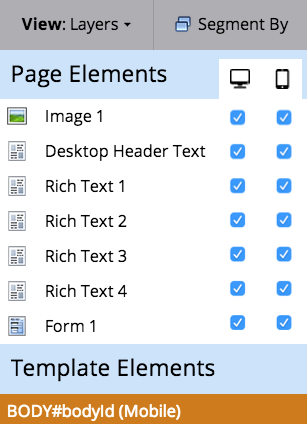

# Personnaliser la vue mobile de votre page de destination à structure libre {#customize-mobile-view-for-your-free-form-landing-page}

>[!PREREQUISITES]
>
>[Ajouter une vue mobile pour votre page de destination de forme libre](/help/marketo/product-docs/demand-generation/landing-pages/free-form-landing-pages/add-a-mobile-view-for-your-free-form-landing-page.md)

L’affichage mobile de votre page de destination de forme libre est principalement automatique, mais vous pouvez la personnaliser.

1. Sélectionnez votre page de destination de forme libre.

   

1. Cliquez sur **[!UICONTROL Modifier le brouillon]**.

   

1. Cliquez sur l’onglet **[!UICONTROL Mobile]**.

   

## Vue Mobile et vue Bureau {#mobile-vs-desktop-view}

Sous Éléments de page, vous verrez une icône  (bureau) et une icône  (mobile). Vous pouvez ainsi afficher/masquer différents éléments de manière dynamique.

Par défaut, tout ce qui se trouve dans la vue Bureau s’affiche dans la vue mobile.

>[!NOTE]
>
>Les rectangles ne s’affichent pas en mode mobile.

## Points importants à connaître {#important-things-to-know}

* Les images s’étendent sur toute la largeur de votre appareil mobile. Si vous souhaitez des images plus petites, extrayez l’élément de texte enrichi et ajoutez votre image à partir de là.
* N’utilisez que des formulaires Forms 2.0. Ils sont réactifs et s’ajustent automatiquement.
* Un seul élément de modèle est modifiable : BODY#bodyid (Mobile). Vous pouvez l’utiliser pour modifier la couleur d’arrière-plan.

  

## Masquer un élément de la vue mobile {#hide-an-element-from-the-mobile-view}

>[!TIP]
>
>Less est more sur mobile.

1. Pour masquer un élément, cochez la case correspondante sous la colonne mobile .

   

1. Cet élément ne sera plus visible dans votre vue mobile.

   

## Ajout d’un élément à la vue mobile {#add-an-element-to-the-mobile-view}

>[!TIP]
>
>Raccourcissez le contenu pour la vue mobile.

1. Pour ajouter un élément, faites-le glisser sur la page de destination de forme libre.

   

   Assurez-vous que l’élément est défini pour s’afficher uniquement sur la vue mobile.

   

>[!TIP]
>
>La vue mobile peut également avoir une disposition différente des éléments de page. Déplacez les éléments sur la page de destination de forme libre ou réorganisez les objets répertoriés sous **[!UICONTROL Éléments de page]** en procédant par glisser-déposer.

## Aperçu de la vue mobile {#preview-mobile-view}

1. Cliquez sur **[!UICONTROL Prévisualiser le brouillon]**.

   

1. Sélectionnez **[!UICONTROL Côte à côte]** pour comparer les versions de bureau et mobile en même temps.

   

1. Vous pouvez désormais afficher simultanément les versions pour ordinateurs de bureau et mobiles de vos pages de destination.

   

1. Cliquez sur **[!UICONTROL Approuver et fermer]**.

   

   >[!NOTE]
   >
   >L’aperçu n’est pas interactif. Chaque smartphone affiche les choses un peu différemment. Nous vous recommandons de prévisualiser votre page de destination sur quelques appareils afin de voir exactement comment elle se comporte.

>[!MORELIKETHIS]
>
>[Rendre un modèle de page de destination de forme libre existant compatible avec les appareils mobiles](/help/marketo/product-docs/demand-generation/landing-pages/landing-page-templates/make-an-existing-free-form-landing-page-template-mobile-compatible.md)
