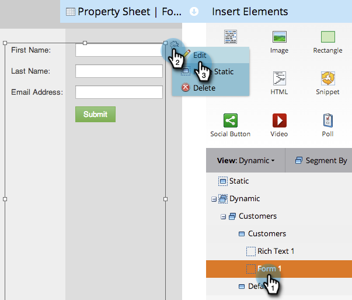

# Utilisation de contenu dynamique dans un Landing page à structure libre {#use-dynamic-content-in-a-free-form-landing-page}

L’utilisation du contenu dynamique dans les Landings page engage votre audience avec des informations ciblées.

>[!PREREQUISITES]
>
>* [Création d’une segmentation](../../../../product-docs/personalization/segmentation-and-snippets/segmentation/create-a-segmentation.md)
>* [Création d’un Landing page de formulaire libre](create-a-free-form-landing-page.md)
>* [Ajouter un nouveau formulaire à un Landing page de formulaire libre](add-a-new-form-to-a-free-form-landing-page.md)

>

## Segmentation des Ajoutes {#add-segmentation}

1. Accédez à Activités **** marketing.

   

   Sélectionnez votre Landing page, puis cliquez sur Modifier le brouillon.

   

   Cliquez sur Segmenter par.

   

   Saisissez le nom de la segmentation et cliquez sur Enregistrer.

   

   Votre segmentation et ses segments s’affichent sous Dynamique à droite.

   

>[!NOTE]
>
>Par défaut, tous les éléments de landing page sont statiques.

## Rendre l’élément dynamique {#make-element-dynamic}

1. Faites glisser les éléments de contenu dynamique de sous **Static** vers **Dynamic.**

   

1. Vous pouvez également créer des éléments **statiques** ou **dynamiques** à partir des **paramètres de l’élément.**

   

## Appliquer du contenu dynamique {#apply-dynamic-content}

1. Sélectionnez un élément sous un segment, cliquez sur l’icône Paramètres, puis sur **Modifier**. Répétez cette opération pour chaque segment.

   

1. Une coche verte indique le contenu spécifique à ce segment. Un blanc indique le contenu du segment par défaut.

   

>[!CAUTION]
>
>Les modifications apportées au bloc de contenu de segment par défaut sont appliquées à tous les segments.

>[!TIP]
>
>Créez un landing page par défaut avant de modifier le contenu des différents segments.

Voila ! Vous pouvez désormais envoyer du contenu ciblé.

>[!NOTE]
>
>**Articles connexes**
>
>* [Prévisualisation d’un Landing page avec du contenu dynamique](../../../../product-docs/demand-generation/landing-pages/landing-page-actions/preview-a-landing-page-with-dynamic-content.md)
>* [Utilisation de contenu dynamique dans un courrier électronique](../../../../product-docs/email-marketing/general/functions-in-the-editor/using-dynamic-content-in-an-email.md)

>

