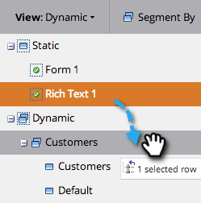
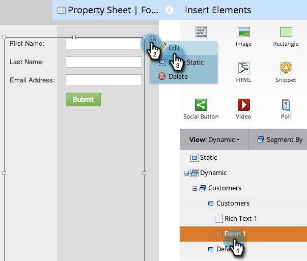

# Utiliser du contenu dynamique dans une page de destination à structure libre {#use-dynamic-content-in-a-free-form-landing-page}

L’utilisation de contenu dynamique dans les pages de destination fait participer votre audience avec des informations ciblées.

>[!PREREQUISITES]
>
>* [Créer une segmentation](/help/marketo/product-docs/personalization/segmentation-and-snippets/segmentation/create-a-segmentation.md)
>* [Créer une page de destination de forme libre](/help/marketo/product-docs/demand-generation/landing-pages/free-form-landing-pages/create-a-free-form-landing-page.md)
>* [Ajouter un nouveau formulaire à une page de destination de forme libre](/help/marketo/product-docs/demand-generation/landing-pages/free-form-landing-pages/add-a-new-form-to-a-free-form-landing-page.md)

## Ajouter une segmentation {#add-segmentation}

1. Accédez à **[!UICONTROL Activités marketing]**.

   

1. Sélectionnez votre page de destination, puis cliquez sur **[!UICONTROL Modifier le brouillon]**.

   

1. Cliquez sur **[!UICONTROL Segmenter par]**.

   

1. Saisissez le nom [!UICONTROL Segmentation] et cliquez sur **[!UICONTROL Enregistrer]**.

   

1. Votre segmentation et ses segments apparaissent sous [!UICONTROL Dynamique] sur la droite.

   

>[!NOTE]
>
>Tous les éléments de la page de destination sont Statiques par défaut.

## Rendre l’élément dynamique {#make-element-dynamic}

1. Faites glisser et déposez les éléments de contenu dynamiques depuis sous **[!UICONTROL Statique]** vers **[!UICONTROL Dynamique]**.

   

1. Vous pouvez également rendre les éléments **[!UICONTROL Statiques]** ou **[!UICONTROL Dynamiques]** à partir de l’élément **[!UICONTROL Paramètres]**.

   

## Application de contenu dynamique {#apply-dynamic-content}

1. Sélectionnez un élément sous un segment, cliquez sur l’icône des paramètres, puis sur **[!UICONTROL Modifier]**. Répétez l’opération pour chaque segment.

   

1. Une coche verte indique le contenu spécifique à ce segment. Un champ vide indique le contenu du segment par défaut.

   

>[!CAUTION]
>
>Les modifications apportées au bloc de contenu de segment par défaut sont appliquées à tous les segments.

>[!TIP]
>
>Créez une page de destination par défaut avant de modifier le contenu des différents segments.

Vous pouvez désormais envoyer du contenu ciblé à vos segments.

>[!MORELIKETHIS]
>
>* [Aperçu d’une page de destination avec du contenu dynamique](/help/marketo/product-docs/demand-generation/landing-pages/landing-page-actions/preview-a-landing-page-with-dynamic-content.md)
>* [Utilisation de contenu dynamique dans un email](/help/marketo/product-docs/email-marketing/general/functions-in-the-editor/using-dynamic-content-in-an-email.md)
