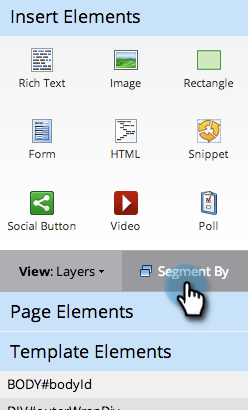

# Utiliser le contenu dynamique dans un Landing page de forme libre {#use-dynamic-content-in-a-free-form-landing-page}

L’utilisation du contenu dynamique dans les Landings page engage votre audience avec des informations ciblées.

>[!PREREQUISITES]
>
>* [Création d’une segmentation](/help/marketo/product-docs/personalization/segmentation-and-snippets/segmentation/create-a-segmentation.md)
>* [Création d’un Landing page de formulaire libre](/help/marketo/product-docs/demand-generation/landing-pages/free-form-landing-pages/create-a-free-form-landing-page.md)
>* [Ajouter un nouveau formulaire à un Landing page de formulaire libre](/help/marketo/product-docs/demand-generation/landing-pages/free-form-landing-pages/add-a-new-form-to-a-free-form-landing-page.md)

## Segmentation des Ajoutes {#add-segmentation}

1. Accédez à **Activités marketing**.

   

1. Sélectionnez votre Landing page, puis cliquez sur **Modifier le brouillon**.

   

1. Cliquez sur **Segmenter par**.

   

1. Saisissez le nom de la segmentation et cliquez sur **Enregistrer**.

   

1. Votre segmentation et ses segments s’affichent sous Dynamique à droite.

   

>[!NOTE]
>
>Par défaut, tous les éléments de landing page sont statiques.

## Rendre l’élément dynamique {#make-element-dynamic}

1. Faites glisser les éléments de contenu dynamique de **Static** vers **Dynamic**.

   

1. Vous pouvez également créer des éléments **Static** ou **Dynamic** à partir de l’élément **Settings**.

   

## Appliquer du contenu dynamique {#apply-dynamic-content}

1. Sélectionnez un élément sous un segment, cliquez sur l’icône Paramètres, puis sur **Modifier**. Répétez cette opération pour chaque segment.

   

1. Une coche verte indique le contenu spécifique à ce segment. Un blanc indique le contenu du segment par défaut.

   

>[!CAUTION]
>
>Les modifications apportées au bloc de contenu de segment par défaut sont appliquées à tous les segments.

>[!TIP]
>
>Créez un landing page par défaut avant de modifier le contenu des différents segments.

Voila ! Vous pouvez désormais envoyer du contenu ciblé.

>[!MORELIKETHIS]
>
>* [Prévisualisation d’un Landing page avec du contenu dynamique](/help/marketo/product-docs/demand-generation/landing-pages/landing-page-actions/preview-a-landing-page-with-dynamic-content.md)
>* [Utilisation de contenu dynamique dans un courrier électronique](/help/marketo/product-docs/email-marketing/general/functions-in-the-editor/using-dynamic-content-in-an-email.md)

