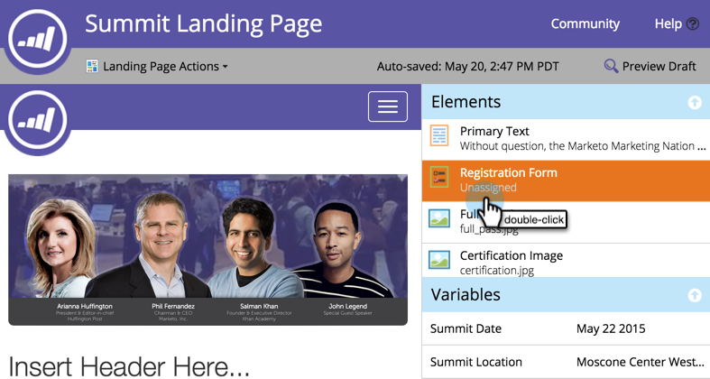
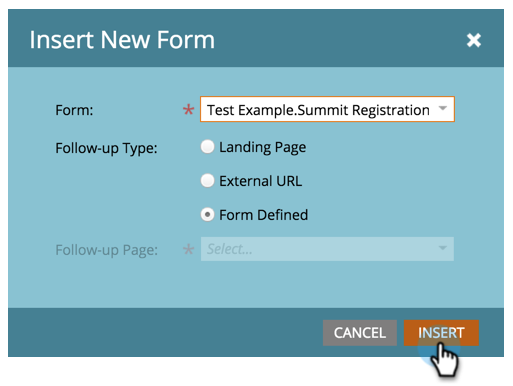

# Ajouter un formulaire à une page de destination guidée {#add-a-form-to-a-guided-landing-page}

>[!PREREQUISITES]
>
>[Créer une page de destination guidée](/help/marketo/product-docs/demand-generation/landing-pages/guided-landing-pages/create-a-guided-landing-page.md)

1. Accédez à la zone **[!UICONTROL Activités marketing]**.

   

1. Recherchez et sélectionnez votre page de destination et cliquez sur **[!UICONTROL Modifier le brouillon]**.

   

   >[!NOTE]
   >
   >Les éléments disponibles dans les pages de destination guidées sont définis par le modèle. Si aucun formulaire ne s’affiche dans le panneau Éléments, sélectionnez un nouveau modèle ou adressez-vous à l’auteur du modèle.

1. Double-cliquez sur le **Formulaire** dans le panneau des éléments.

   

1. Sélectionnez le formulaire que vous souhaitez ajouter.

   

1. Trois options s’offrent à vous pour choisir votre page de relance :

   * **[!UICONTROL Page de destination]** - sélectionnez une page de destination Marketo
   * **[!UICONTROL URL externe]** - sélectionnez l’URL de votre choix
   * **[!UICONTROL Formulaire défini]** - utilisez les paramètres définis au niveau du formulaire

   >[!NOTE]
   >
   >La page de suivi est la page que les personnes verront après avoir envoyé le formulaire.

1. Dans cet exemple, sélectionnez [!UICONTROL &#x200B; Formulaire défini &#x200B;]. Cliquez sur **[!UICONTROL Insérer]**.

   

   

Fermez l’éditeur de page de destination et [approuvez le brouillon de page de destination](/help/marketo/product-docs/demand-generation/landing-pages/understanding-landing-pages/approve-unapprove-or-delete-a-landing-page.md).
