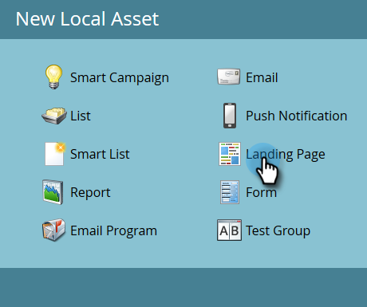

# Création d’un Landing page guidé {#create-a-guided-landing-page}

>[!NOTE]
>
>Les modes de landing page sont définis par leur modèle. [En savoir plus](/help/marketo/product-docs/demand-generation/landing-pages/understanding-landing-pages/understanding-free-form-vs-guided-landing-pages.md) sur les modèles de landing page libre et guidé.

>[!PREREQUISITES]
>
>Pour utiliser un modèle personnalisé, vous devez d’abord [créer un modèle](/help/marketo/product-docs/demand-generation/landing-pages/landing-page-templates/create-a-guided-landing-page-template.md)de landing page guidé.

## Création d’un Landing page guidé dans un Programme {#create-a-guided-landing-page-in-a-program}

Les landings page guidés peuvent être créés en tant que ressources locales d’un programme ou dans Design Studio à utiliser globalement.

1. Accédez à Activités **** marketing.

   

1. Sélectionnez votre programme.

   

1. Cliquez sur la liste **déroulante Nouveau** . Sélectionnez **Nouveau fichier** local.

   

1. Sélectionnez **Landing page**.

   

1. Nommez votre landing page. Cliquez sur la liste déroulante **Modèle** et sélectionnez Modèle **** guidé.

   >[!NOTE]
   >
   >Les modèles de landing page guidé comportent l’  icône en regard d’eux. Les modèles guidés sont structurés de manière à ce qu’ils puissent rester entièrement réactifs.

   

## Création d’un Landing page dans Design Studio {#create-a-landing-page-in-design-studio}

1. Accédez à **Design Studio**.

   

1. Cliquez sur la liste **déroulante Nouveau** . Sélectionnez **Nouveau Landing page**.

   

1. Nommez votre landing page. Cliquez sur la liste déroulante **Modèle** et sélectionnez Modèle **** guidé.

   

1. Cliquez sur **Créer**.

   

>[!TIP]
>
>L’URL est construite automatiquement à partir des noms de programme et de landing page. Pour modifier l’URL, modifiez le champ URL **de la** page.
>
>Décochez la case **Ouvrir dans l’éditeur** si vous ne souhaitez pas que l’éditeur s’ouvre immédiatement après avoir cliqué sur **Créer**.
