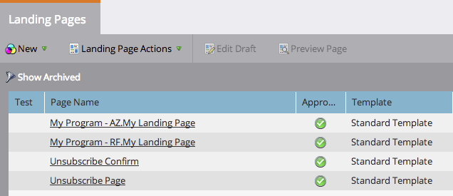

# Approuver plusieurs Landings page à la fois {#approve-multiple-landing-pages-at-once}

1. Accédez à **Design Studio**.

   

1. Cliquez sur **Landings page**.

   

1. Maintenez la touche Ctrl (Windows) ou Commande (Mac) enfoncée et cliquez pour sélectionner plusieurs landings page.

   

   >[!TIP]
   >
   >Ne cliquez pas sur le nom réel du landing page, ce sont des liens et vous conduiront à la page elle-même.

1. Une fois vos landings page sélectionnés, accédez à **Actions du Landing page** et cliquez sur **Approuver**.

   

   Voilà ! Vous pouvez désormais approuver facilement et rapidement plusieurs landings page.

   

   >[!TIP]
   >
   >Vous pouvez également utiliser les étapes ci-dessus pour d’autres options en bloc, telles que la désapprobation ou la suppression.
