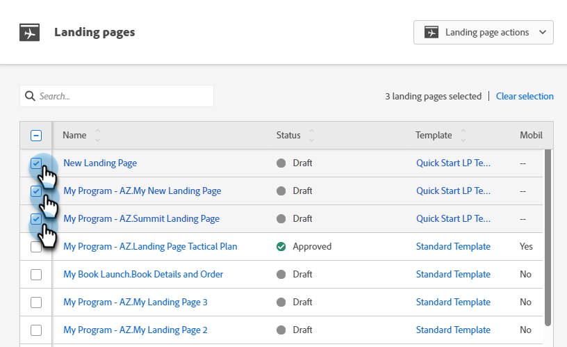

# Approuver plusieurs pages de destination à la fois {#approve-multiple-landing-pages-at-once}

1. Accédez à **[!UICONTROL Design Studio]**.

   

1. Cliquez sur **[!UICONTROL Pages de destination]**.

   

1. Sélectionnez les pages de destination de votre choix.

   

   >[!TIP]
   >
   >Ne cliquez pas sur le nom réel de la page de destination. Il s’agit de liens qui vous mèneront à la page elle-même.

1. Une fois vos pages de destination sélectionnées, cliquez sur le menu déroulant **Actions de page de destination** et sélectionnez **Approuver**.

   

1. Cliquez sur **Approuver**.

   

   >[!TIP]
   >
   >Vous pouvez également suivre les étapes ci-dessus pour d’autres options en bloc, telles que l’annulation de l’approbation ou la suppression.
