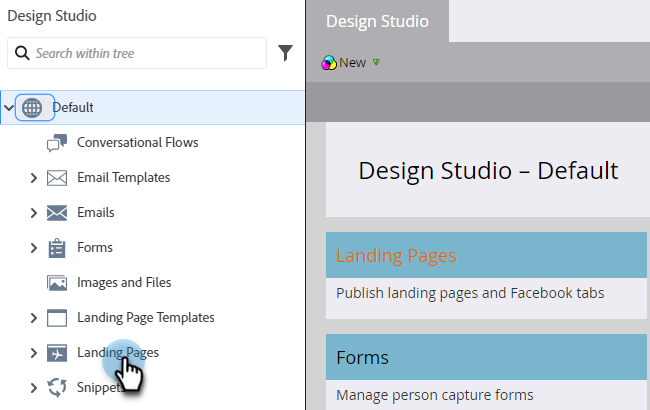

# Approuver plusieurs landing pages à la fois {#approve-multiple-landing-pages-at-once}

1. Accédez à **Design Studio**.

   

1. Cliquez sur **Landing Pages**.

   

1. Sélectionnez les pages d’entrée de votre choix.

   

   >[!TIP]
   >
   >Ne cliquez pas sur le nom réel de la page d’entrée. Il s’agit de liens qui vous mèneront à la page elle-même.

1. Une fois vos pages d’entrée sélectionnées, cliquez sur la liste déroulante **Actions de page d’entrée** et sélectionnez **Approuver**.

   

1. Cliquez sur **Approve**.

   

   >[!TIP]
   >
   >Vous pouvez également utiliser les étapes ci-dessus pour d’autres options en bloc, comme annuler l’approbation ou supprimer.
