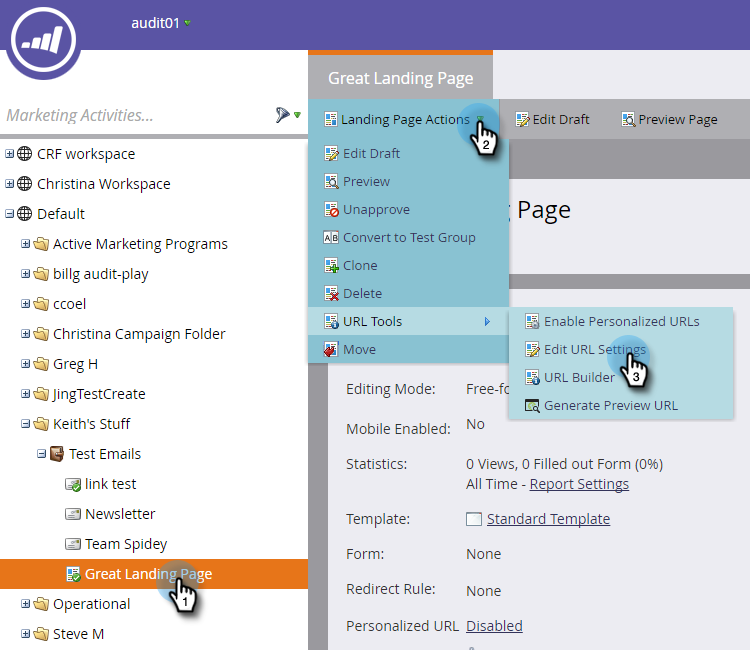
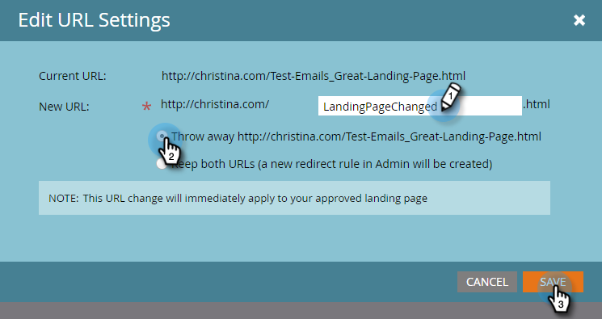

# Modifier l’URL du Landing page {#change-the-landing-page-url}

Vous pouvez modifier l’URL d’un landing page. Cela peut aider à rendre l’URL plus facile à mémoriser et à améliorer l’optimisation du référencement.

1. Sélectionnez votre landing page. Cliquez sur la liste déroulante **Actions de Landing page**, faites défiler l&#39;écran jusqu&#39;à **Outils d&#39;URL** et sélectionnez **Modifier les paramètres d&#39;URL**.

   

1. Saisissez la **nouvelle URL**, choisissez de supprimer ou de rediriger l’ancienne URL, puis cliquez sur **Enregistrer**.

   

   >[!NOTE]
   >
   >Si vous décidez de conserver les deux URL, une règle de redirection est créée automatiquement. En savoir plus sur les [redirections URL](/help/marketo/product-docs/demand-generation/landing-pages/personalizing-landing-pages/redirect-a-url-path.md).
