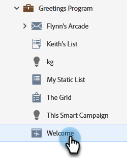
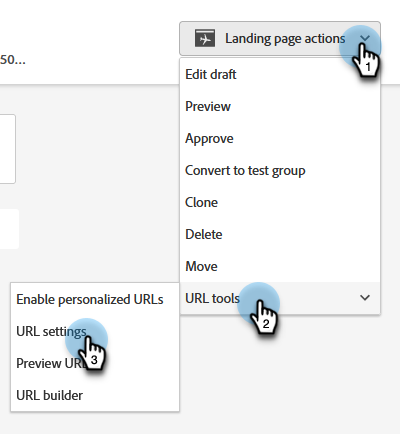

# Modification de l’URL de la page d’entrée {#change-the-landing-page-url}

Vous pouvez modifier l’URL d’une landing page. Cela peut faciliter la mise en mémoire et l’optimisation du référencement de l’URL.

1. Recherchez et sélectionnez la Landing Page de votre choix.

   

1. Cliquez sur la liste déroulante **Actions de page d’entrée**, faites défiler l’écran jusqu’à **Outils d’URL** et sélectionnez **Paramètres d’URL**.

   

1. Saisissez la **Nouvelle URL**, choisissez de supprimer ou de rediriger l’ancienne URL, puis cliquez sur **Enregistrer**.

   

   >[!NOTE]
   >
   >Si vous décidez de conserver les deux URL, une règle de redirection sera créée automatiquement. En savoir plus sur les [redirections d’URL](/help/marketo/product-docs/demand-generation/landing-pages/personalizing-landing-pages/redirect-a-url-path.md).
