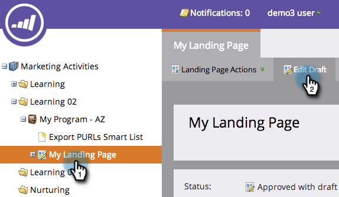

# Modifier le titre et les métadonnées de la page d’entrée {#edit-landing-page-title-and-metadata}

Marketo vous permet de modifier votre landing page. [meta-balises à des fins d’optimisation pour les moteurs de recherche](https://www.w3schools.com/tags/tag_meta.asp) ainsi que de personnaliser la variable `<head>` du HTML.

1. Sélectionnez une landing page et cliquez sur **Modifier le brouillon**.

   

   >[!NOTE]
   >
   >Le concepteur de landing page s’ouvre dans une nouvelle fenêtre.

1. Sous **Actions de page d’entrée**, cliquez sur **Modification des métadonnées de page**.

   

1. Saisissez le **Titre**, **Mots-clés**, et **Description** pour votre page. Sélectionnez la **Robots** et saisissez le contenu personnalisé de votre choix pour le HTML `<head>` . Cliquez sur **Enregistrer**.

   

   >[!TIP]
   >
   >**Que faire ? [robots](https://www.robotstxt.org/meta.html) vous voulez dire ?**
   >
   >**index**: La page peut faire l’objet de recherches sur le Web. **Follow**: les moteurs de recherche peuvent suivre les liens sur les pages indexées.

1. Modifiez les balises à tout moment et approuvez la landing page.
