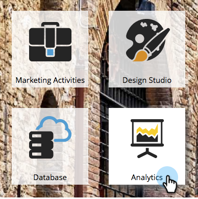

# Filtrage d’un rapport Performance de page d’entrée {#filter-a-landing-page-performance-report}

Concentrez votre [ rapport de performances de page d’entrée ](/help/marketo/product-docs/demand-generation/landing-pages/understanding-landing-pages/landing-page-performance-report.md) sur les pages d’entrée de vos programmes (ressources locales), sur celles de Design Studio (ressources globales) ou sur celles qui ont été archivées.

1. Accédez à **Analytics** (ou **Activités marketing**).

   

1. Sélectionnez votre rapport de page d’entrée dans l’arborescence de navigation.

   

1. Cliquez sur l’onglet **Configuration** et faites glisser un filtre.

   

   * **Pages d’entrée de Design Studio :** ressources globales, gérées dans Design Studio.
   * **Pages d’entrée des activités marketing :** ressources locales dans les programmes dans l’onglet Activités marketing.
   * **Pages d’entrée archivées :** landing pages inactives et retirées.

1. Sélectionnez les dossiers et les landing pages spécifiques à inclure dans votre rapport.

   

   >[!TIP]
   >
   >Si vous sélectionnez un dossier, votre rapport inclura tout ce qu’il contient au moment de l’exécution du rapport.

1. Vous avez fini ! Cliquez sur l’onglet **Rapport** pour afficher votre rapport filtré.

   
