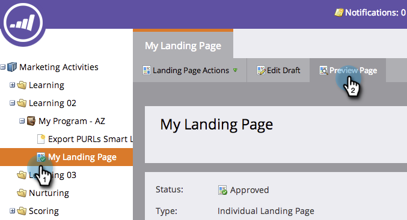

# Aperçu d’une page d’entrée avec du contenu dynamique {#preview-a-landing-page-with-dynamic-content}

Prévisualisez votre landing page après avoir ajouté du contenu dynamique pour vous assurer que tout se présente comme prévu.

>[!PREREQUISITES]
>
>* [Utilisation de contenu dynamique dans une page d’entrée](/help/marketo/product-docs/demand-generation/landing-pages/personalizing-landing-pages/use-dynamic-content-in-a-landing-page.md)
>* [Aperçu d’une page d’entrée](/help/marketo/product-docs/demand-generation/landing-pages/landing-page-actions/preview-a-landing-page.md)

1. Sélectionnez une landing page et cliquez sur **Aperçu de la page**.

   

1. Cliquez sur la liste déroulante et sélectionnez une **Segment** pour la prévisualiser.

   

Super ! Vous pouvez désormais vous assurer que vos landing pages fonctionnent comme prévu dans plusieurs segments.
